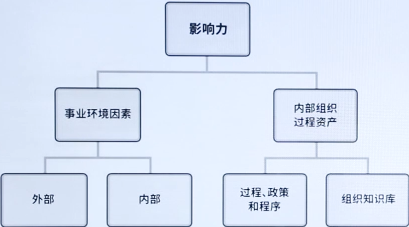

# PMP导学课

[TOC]

> 本文涉及 “—— XX” 均代表为 “PMBOK（第六版） XX页”

# 一、引论

> PMBOK	1.2.1-1.2.5

## 1.1、什么是项目

> **项目的特性**

- **独特性**

  实现项目目标可能会产生以下一个或多个**独特的产品、成果、服务或者组合**。

- **临时性**

  项目的“临时性”是指项目**有明确的起点和终点**。

- **项目驱动变革**

  从商业角度来看，项目旨在推动组织**从一个状态转到另-个状态**，从而达成特定目标。

- **渐进明细**

  随着项目的实施，项目的组成部分**逐渐细化**。

- **项目创造价值**

  项目的成果能够为相关方带来**有形或无形的效益**。

- **满足组织需要**

  项目为组织提供了能够成功应对所需的**变更的解决途径**。

> **名词解析——项目**

- 项目是为创造**独特**的**产品**、**服务或成果**而进行的**临时性**工作。	——4

## 1.2、项目管理的重要性

> **名词解释——项目管理**

- 项目管理(Project Management)是运用各种相关**技能、方法与工具**，为满足或超越项目有关**各方**对项目的**要求与期望**，所开展的各种**计划、组织、领导、控制**等方面的活动。

> **重要性**

- **新技术的涌现**

  人类知识在以几何级数涌现。**5G、Al、 物联网、区块链**等新技术为制造产品、提供服务，解决在生产、分销等方面的问题，提供了无限的可能。

- **需求的细分**

  在科技大爆炸的同时，受众群体基于文化、年龄、性别、偏好等因素越来越细分，对**个性化产品、个性化服务**的需求快速增长。

- **市场的全球化**

  **全球市场文化与环境的差异**，直接影响到企业如何进行生产、提供服务。

## 1.3、项目、项目集、项目组合及运营管理

> **关系**

- **项目集**:是一组**相互关联**且被协调管理的项目、子项目集和项目集活动，以便获得**分别管理所无法获得的利益**。

- **项目组合**:是指为**实现战略目标**而组合在一起管理的项目、项目集、子项目组合和**运营**工作。
- **运营管理**：重点管理那些把各种输入(如材料、零件、能源和劳力)**转变为输出**(如产品、商品和(或)服务)的过程。

|            | 项目         | 项目集                                     | 项目组合                                     |
| ---------- | ------------ | ------------------------------------------ | -------------------------------------------- |
| **负责人** | 项目经理     | 项目集经理                                 | 项目组合经理                                 |
| **关注点** | 实现项目目标 | 协调项目集内部组件的活动，**获得最大收益** | 对有限的资源进行**排序**和确定**优先级**关系 |

|          | 项目管理         | 运营管理         |
| -------- | ---------------- | ---------------- |
| 管理对象 | 针对具体项目     | 企业**生产经营** |
| 管理方法 | 针对**具体任务** | 针对日常运行     |
| 管理周期 | **临时性**       | **持续性**       |
| 管理目标 | **关注结果**     | **关注效率**     |

## 1.4、指南的组成部分

| 《PMBOK指南》关键组成部分 | 简介                                                         |
| ------------------------- | ------------------------------------------------------------ |
| 项目生命周期              | 项目从开始到结束所经历的**一系列阶段**                       |
| 项目阶段                  | 一组具有逻辑关系的项目活动的集合，通常**以一个或多个可交付成果的完成**为结束 |
| 阶段关口                  | 为做出进入下个阶段、进行整改或结束项目集或项目的决定，而开展的**阶段末审查** |
| 项目管理过程              | 旨在创造最终结果的系统化的**系列活动**，以便对一个或多个输入进行加工，生成-一个或多个输出 |
| 项目管理过程组            | 项目管理输入、工具和技术以及输出的逻辑组合。项目管理过程组包括启动、规划、执行、监控和收尾。**项目管理过程组不同于项目阶段** |
| 项目管理知识领域          | 按**所需知识内容**来定义的项目管理领域，并用其所含过程、做、输入、输出、工具和技术进行描述。 |

### 1.4.1、项目生命周期

|              | 预测型/瀑布型                                                | 迭代型+增量型                                                | 敏捷型                                         |
| ------------ | ------------------------------------------------------------ | ------------------------------------------------------------ | ---------------------------------------------- |
| **特点**     | **阶段清晰、顺序执行、环环相扣**                             | 迭：**反复求精**、从模糊到清晰 增：**逐块构建**、每次构建一点点 | **频繁交付**，实现用户价值                     |
| **需求**     | 需求在开发前预先确定                                         | 需求在交付期间定期细化                                       | 需求在交付期间频繁细化                         |
| **交付**     | 针对最终可交付成果制定交付计划，然后在项目终了时一次交付最终产品 | 分次交付整体产品的各种子集                                   | 频繁交付对客户有价值的各种子集(隶属于整体产品) |
| **变更**     | 尽量限制变更                                                 | 定期把变更融入项目                                           | 在交付期间实时把变更融入项目                   |
| **相关方**   | 关键相关方在特定里程碑时点参与                               | 关键相关方定期参与                                           | 关键相关方持续参与                             |
| **风险成本** | 通过对基本可知情况编制详细计划而控制风险和成本               | 通过用新信息逐渐细化计划而控制风险和成本                     | 随需求和制约因素的显现而控制风险和成本         |

### 1.4.2、项目阶段

- **启动-规划-执行-监控-收尾**

### 1.4.3、阶段关口

- **阶段关口**：在不同的组织、行业或工作类型中，阶段关口可能被称为**阶段审查**、阶段门、**关键决策点**和阶段入口或阶段出口。

### 1.4.4、项目管理过程

- 启动**2**+规划**24**+执行过程**10**+监控过程**12**+收尾**1**=**49**个 ITO （**输入-工具/技术-输出**）

## 1.5、项目管理商业文件

### 1.5.1、定义

- **项目商业论证**：（立项之前，不属项目文件）

  文档化的经济可行性研究报告，用来对尚缺乏充分定义的所选方案的收益进行有效性论证，是**启动后续项目管理活动的依据**。

- **项目效益管理计划**：

  对创造、提高和保持项目效益的过程进行定义的书面文件。

### 1.5.2、项目的商业价值

- **有形收益**：**货币资产、股东权益**、公共事业、固定设施、工具、市场份额。
- **无形收益**：**商誉**、**品牌认知度**、公共利益、商标、战略一致性、声誉。

# 二、项目运行环境

> PMBOK	2.1-2.4

## 2.1、概述

**项目所处的环境可能对项目的开展产生有利或不利的影响:**
事业环境因素
组织过程资产

## 2.2、事业环境因素

> 对项目形成制约

- **资源可用性**

  例如包括合同和采购制约因素、获得批准的供应商和分包商以及合作协议。

- **法律限制、政府或行业标准**

  例如包括与产品、生产、环境、质量和工艺有美的监管机构条例和标准。

- **组织文化、结构和治理**

  例如包括**愿景（大家全力以赴的未来方向）**、使命、价值观、信念、文化规范、领导风格、等级制度和职权美系、组织凤格、道德和行为规范。

## 2.3、组织过程资产

> 对当前项目起到借鉴作用

1. **过程、政策和程序**

- **指南和标准**，用于裁剪组织标准流程和程序以满足项目的特定要求

- 特定的组织标准
- 产品和**项目生命周期**，以及方法和程序

2. **组织知识库**

- 配置管理知识库

- **历史信息与经验教训知识库**

- 以往项目的项目档案

## 2.4、组织系统

> 名词解析——治理

- **治理**是各种公共的或私人的个人和机构管理其共同事务的**诸多方法的总和**，是使相互冲突的或不同的利益得以调和，并采取联合行动的持续过程。

- 项目治理并不是为了替代项目经理做决策，而是为了**限制错误决策的发生**。

**组织结构类型**

|                            | 工作组安排人                       | 项目经理批准 | 项目经理的角色                                               | 资源可用性   | 项目预算管理人 | 项目管理人员   |
| -------------------------- | ---------------------------------- | ------------ | ------------------------------------------------------------ | ------------ | -------------- | -------------- |
| **系统型或简单型**         | 灵活；人员并肩作战                 | 极少或无     | 兼职；工作角色（如协调员）指定与否不限                       | 极少或无     | 负责人或操作员 | 极少或无       |
| **职能（集中式）**         | 正在进行的工作（例如：设计、制造） | 极少或无     | 兼职；工作角色（如协调员）指定与否不限                       | 极少或无     | 职能经理       | 兼职           |
| **矩阵-强**                | 按工作职能，项目经理作为一个职能   | 中到高       | 全职指定工作角色                                             | 中到高       | 项目经理       | 全职           |
| **矩阵-弱**（最常见）      | 工作职能                           | 低           | 兼职；作为另一项工作的组成部分，并非制定工作角色，（如协调员） | 低           | 职能经理       | 兼职           |
| **矩阵-均衡**              | 工作职能                           | 低到中       | 兼职；作为另一项工作的组成部分，并非制定工作角色，（如协调员） | 低到中       | 混合           | 兼职           |
| **项目导向（复合、混合）** | 项目                               | 高到几乎全部 | 全职指定工作角色                                             | 高到几乎全部 | 项目经理       | 全职           |
| **虚拟**                   | 网络架构，带有与他人联系的节点     | 低到中       | 全职或兼职                                                   | 低到中       | 混合           | 可为全职或兼职 |
| **PMO**                    | 其他类型的混合                     | 高到几乎全部 | 全职指定工作角色                                             | 高到几乎全部 | 项目经理       | 全职           |

| 职能型优点             | 职能型缺点             | 项目型优点               | 项目型缺点                 | 矩阵型优点                       | 矩阵型缺点         |
| ---------------------- | ---------------------- | ------------------------ | -------------------------- | -------------------------------- | ------------------ |
| 预算简单，便于控制成本 | **无人对整体项目负责** | **项目内部职权清晰**     | **资源配备重复且低效**     | 可以为每个项目单独指定政策和程序 | 信息流。工作多维化 |
| 有充足的工作人员       | **协调十分困难**       | 沟通渠道顺畅             | 容易出现资源管理问题       | 项目成本最小                     | **双重领导**       |
| **人员容易控制**       | 责任难以确定           | **响应及时**             | 项目与项目之间缺乏互动交流 | **可以灵活动用组织资源**         | **监督与控制困难** |
| 职能纪律稳定           | 对客户需求反应迟钝     | 时间、成本和绩效具有弹性 | **人员缺少稳定性**         | 权利与责任共担                   | 冲突几率较高       |
| **沟通渠道垂直且顺畅** | 缺乏项目意识           |                          |                            |                                  |                    |

> **项目管理办公室**

- 项目管理的**复杂性**，和要求项目经理能够**快速响应**、快速上手实施项目是一对**先天矛盾**。 

**六大职能**

- **战略职能**：分解组织战略，选择合适的项目
- **开发职能**：搭建项目管理体系
- **咨询职能**：对项目经理求助进行响应
- **运作职能**：直接对项目经理进行管理
- **控制职能**：计划审批、状态跟踪、绩效监控
- **支持职能**：提供低级别的

**PMO类型**

- **支持型**：为项目实施提供帮助

- **控制型**：要求项目经理遵循/完成一些指令

- **指令型**：对项目控制型更强，可以直接要求/指派项目经理去管理项目

# 三、项目经理的概述

> PMBOK	3.1-3.4

## 3.1、概述

> **项目经理的角色**

需要了解成员的特色和角色整合起来发挥作用、了解组织战略和目标、了解行业。

## 3.2、项目经理影响力范围

- 在**客户**的层级上：

  对于项目经理来说，要能够**应对冲突，维护好项目**的整体性。

- 在**公司**的层级上：

  项目经理需要对**资源**妥善保护、及时准确的进行沟通。

- 在**项目团队**的层级上：

  项目经理作为**项目团队**的**负责人**，要对项目团队成员积极主动管理。

- 在**行业**层级上：

  项目经理应该时刻关注**行业的发展趋势**，预判行业趋势对于项目的影响。

- 在**专业学科**层级上：

  项目经理应该意识到，持续的对知识进行**传递和整合**非常重要。

- 在**跨领域**层级上：

  做为一名优秀的项目经理，要敢于尝试在**传统应用领域外**的应用项目管理技术。

## 3.3、项目经理的能力

- **技术项目管理:** 

  与项目、项目集和项目组合管理特定领域相关的知识、技能和行为,即角色履行的技术方面。

- **领导力:**

  指导、激励和带领团队所需的知识，技能和行为，可帮助组织达成业务目标。

- **战略和商务管理:**

  关于行业和组织的知识和专业技能，有助于提高绩效并取得更好的业务成果。

> 领导力风格

- **放任型：**

  允许团队**自主决策**和设定目标。又被称为“无为而治”

- **交易型：**

  关注目标、反馈和成就以确定**奖励**，例外管理

- **交互型：**

  **结合**了交易型、变革型和魅力型领导的特点

- **服务型：**

  *做出服务承诺。处处先**为他人着想;**

- **变革型：**

  *通过理想化特质和行为、鼓舞性激励、促进**创新和创造**，

- **魅力型：**

  能够**激励他人**:精神饱满、热情洋溢，充满自信

## 3.4、执行整合

- **过程的整合:**

  项目经理要梳理各种项目管理活动之间的**依赖关系**、轻重缓急，让这些项目管理过程相互作用。

- 认知的整合:

  项目经理可以将**经验、见解、领导力、技术以及商业管理技能**运用到项目管理中。

- **背景的整合:**

  项目经理需要意识到项目背景和出现的**新因素**。