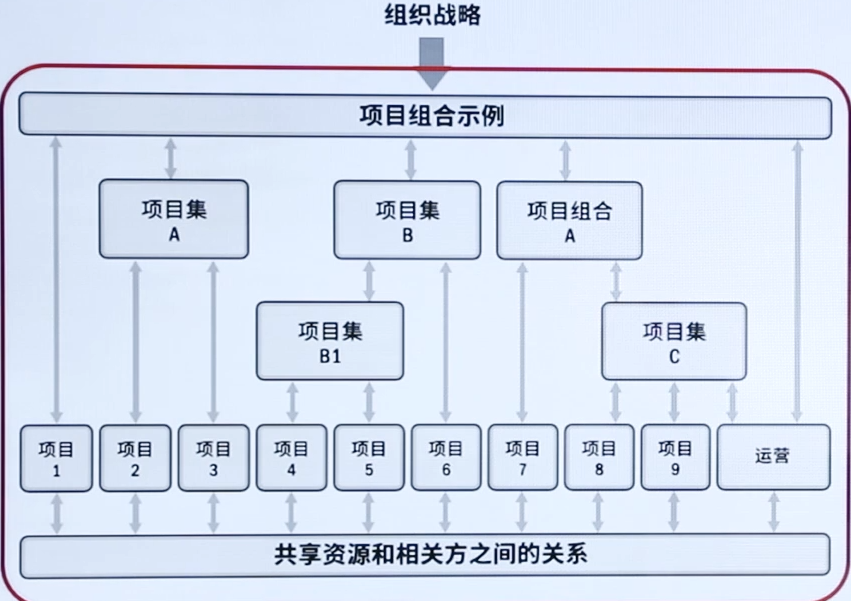
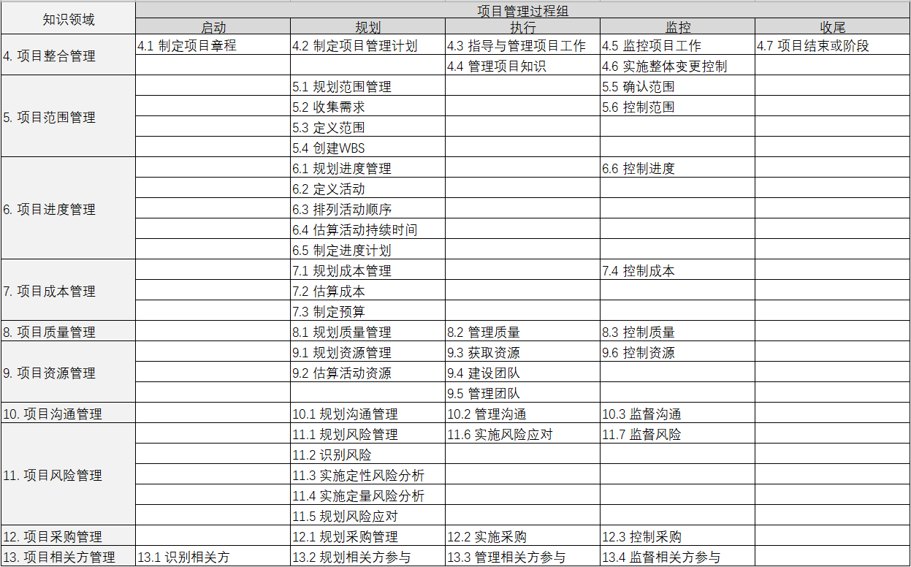

# PMP导学课

[TOC]

> 本文涉及 “—— XX” 均代表为 “PMBOK（第六版） XX页”

# 一、引论

> PMBOK	1.2.1-1.2.5

## 1.1、什么是项目

> **项目的特性**

- **独特性**

  实现项目目标可能会产生以下一个或多个**独特的产品、成果、服务或者组合**。

- **临时性**

  项目的“临时性”是指项目**有明确的起点和终点**。

- **项目驱动变革**

  从商业角度来看，项目旨在推动组织**从一个状态转到另-个状态**，从而达成特定目标。

- **渐进明细**

  随着项目的实施，项目的组成部分**逐渐细化**。

- **项目创造价值**

  项目的成果能够为相关方带来**有形或无形的效益**。

- **满足组织需要**

  项目为组织提供了能够成功应对所需的**变更的解决途径**。

> **名词解析——项目**

- 项目是为创造**独特**的**产品**、**服务或成果**而进行的**临时性**工作。	——4

## 1.2、项目管理的重要性

> **名词解释——项目管理**

- 项目管理(Project Management)是运用各种相关**技能、方法与工具**，为满足或超越项目有关**各方**对项目的**要求与期望**，所开展的各种**计划、组织、领导、控制**等方面的活动。

> **重要性**

- **新技术的涌现**

  人类知识在以几何级数涌现。**5G、Al、 物联网、区块链**等新技术为制造产品、提供服务，解决在生产、分销等方面的问题，提供了无限的可能。

- **需求的细分**

  在科技大爆炸的同时，受众群体基于文化、年龄、性别、偏好等因素越来越细分，对**个性化产品、个性化服务**的需求快速增长。

- **市场的全球化**

  **全球市场文化与环境的差异**，直接影响到企业如何进行生产、提供服务。

## 1.3、项目、项目集、项目组合及运营管理

> **关系**

- **项目集**:是一组**相互关联**且被协调管理的项目、子项目集和项目集活动，以便获得**分别管理所无法获得的利益**。

- **项目组合**:是指为**实现战略目标**而组合在一起管理的项目、项目集、子项目组合和**运营**工作。
- **运营管理**：重点管理那些把各种输入(如材料、零件、能源和劳力)**转变为输出**(如产品、商品和(或)服务)的过程。

|            | 项目         | 项目集                                     | 项目组合                                     |
| ---------- | ------------ | ------------------------------------------ | -------------------------------------------- |
| **负责人** | 项目经理     | 项目集经理                                 | 项目组合经理                                 |
| **关注点** | 实现项目目标 | 协调项目集内部组件的活动，**获得最大收益** | 对有限的资源进行**排序**和确定**优先级**关系 |

|          | 项目管理         | 运营管理         |
| -------- | ---------------- | ---------------- |
| 管理对象 | 针对具体项目     | 企业**生产经营** |
| 管理方法 | 针对**具体任务** | 针对日常运行     |
| 管理周期 | **临时性**       | **持续性**       |
| 管理目标 | **关注结果**     | **关注效率**     |

## 1.4、指南的组成部分

| 《PMBOK指南》关键组成部分 | 简介                                                         |
| ------------------------- | ------------------------------------------------------------ |
| 项目生命周期              | 项目从开始到结束所经历的**一系列阶段**                       |
| 项目阶段                  | 一组具有逻辑关系的项目活动的集合，通常**以一个或多个可交付成果的完成**为结束 |
| 阶段关口                  | 为做出进入下个阶段、进行整改或结束项目集或项目的决定，而开展的**阶段末审查** |
| 项目管理过程              | 旨在创造最终结果的系统化的**系列活动**，以便对一个或多个输入进行加工，生成-一个或多个输出 |
| 项目管理过程组            | 项目管理输入、工具和技术以及输出的逻辑组合。项目管理过程组包括启动、规划、执行、监控和收尾。**项目管理过程组不同于项目阶段** |
| 项目管理知识领域          | 按**所需知识内容**来定义的项目管理领域，并用其所含过程、做、输入、输出、工具和技术进行描述。 |

### 1.4.1、项目生命周期

|              | 预测型/瀑布型                                                | 迭代型+增量型                                                | 敏捷型                                         |
| ------------ | ------------------------------------------------------------ | ------------------------------------------------------------ | ---------------------------------------------- |
| **特点**     | **阶段清晰、顺序执行、环环相扣**                             | 迭：**反复求精**、从模糊到清晰 增：**逐块构建**、每次构建一点点 | **频繁交付**，实现用户价值                     |
| **需求**     | 需求在开发前预先确定                                         | 需求在交付期间定期细化                                       | 需求在交付期间频繁细化                         |
| **交付**     | 针对最终可交付成果制定交付计划，然后在项目终了时一次交付最终产品 | 分次交付整体产品的各种子集                                   | 频繁交付对客户有价值的各种子集(隶属于整体产品) |
| **变更**     | 尽量限制变更                                                 | 定期把变更融入项目                                           | 在交付期间实时把变更融入项目                   |
| **相关方**   | 关键相关方在特定里程碑时点参与                               | 关键相关方定期参与                                           | 关键相关方持续参与                             |
| **风险成本** | 通过对基本可知情况编制详细计划而控制风险和成本               | 通过用新信息逐渐细化计划而控制风险和成本                     | 随需求和制约因素的显现而控制风险和成本         |

### 1.4.2、项目阶段

- **启动-规划-执行-监控-收尾**

### 1.4.3、阶段关口

- **阶段关口**：在不同的组织、行业或工作类型中，阶段关口可能被称为**阶段审查**、阶段门、**关键决策点**和阶段入口或阶段出口。

### 1.4.4、项目管理过程

- 启动**2**+规划**24**+执行过程**10**+监控过程**12**+收尾**1**=**49**个 ITO （**输入-工具/技术-输出**）

## 1.5、项目管理商业文件

### 1.5.1、定义

- **项目商业论证**：（立项之前，不属项目文件）

  文档化的经济可行性研究报告，用来对尚缺乏充分定义的所选方案的收益进行有效性论证，是**启动后续项目管理活动的依据**。

- **项目效益管理计划**：

  对创造、提高和保持项目效益的过程进行定义的书面文件。

### 1.5.2、项目的商业价值

- **有形收益**：**货币资产、股东权益**、公共事业、固定设施、工具、市场份额。
- **无形收益**：**商誉**、**品牌认知度**、公共利益、商标、战略一致性、声誉。

# 二、项目运行环境

> PMBOK	2.1-2.4