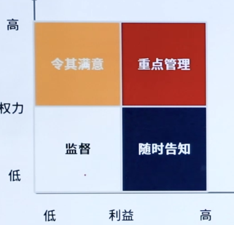

[TOC]

> 本文涉及 “—— XX” 均代表为 “PMBOK（第六版） XX页”

# 一、引论

> PMBOK	1.2.1-1.2.5

## 1.1、什么是项目

> **项目的特性**

- **独特性**

  实现项目目标可能会产生以下一个或多个**独特的产品、成果、服务或者组合**。

- **临时性**

  项目的“临时性”是指项目**有明确的起点和终点**。

- **项目驱动变革**

  从商业角度来看，项目旨在推动组织**从一个状态转到另-个状态**，从而达成特定目标。

- **渐进明细**

  随着项目的实施，项目的组成部分**逐渐细化**。

- **项目创造价值**

  项目的成果能够为相关方带来**有形或无形的效益**。

- **满足组织需要**

  项目为组织提供了能够成功应对所需的**变更的解决途径**。

> **名词解析——项目**

- 项目是为创造**独特**的**产品**、**服务或成果**而进行的**临时性**工作。	——4

## 1.2、项目管理的重要性

> **名词解释——项目管理**

- 项目管理(Project Management)是运用各种相关**技能、方法与工具**，为满足或超越项目有关**各方**对项目的**要求与期望**，所开展的各种**计划、组织、领导、控制**等方面的活动。

> **重要性**

- **新技术的涌现**

  人类知识在以几何级数涌现。**5G、Al、 物联网、区块链**等新技术为制造产品、提供服务，解决在生产、分销等方面的问题，提供了无限的可能。

- **需求的细分**

  在科技大爆炸的同时，受众群体基于文化、年龄、性别、偏好等因素越来越细分，对**个性化产品、个性化服务**的需求快速增长。

- **市场的全球化**

  **全球市场文化与环境的差异**，直接影响到企业如何进行生产、提供服务。

## 1.3、项目、项目集、项目组合及运营管理

> **关系**

- **项目集**:是一组**相互关联**且被协调管理的项目、子项目集和项目集活动，以便获得**分别管理所无法获得的利益**。

- **项目组合**:是指为**实现战略目标**而组合在一起管理的项目、项目集、子项目组合和**运营**工作。
- **运营管理**：重点管理那些把各种输入(如材料、零件、能源和劳力)**转变为输出**(如产品、商品和(或)服务)的过程。

|            | 项目         | 项目集                                     | 项目组合                                     |
| ---------- | ------------ | ------------------------------------------ | -------------------------------------------- |
| **负责人** | 项目经理     | 项目集经理                                 | 项目组合经理                                 |
| **关注点** | 实现项目目标 | 协调项目集内部组件的活动，**获得最大收益** | 对有限的资源进行**排序**和确定**优先级**关系 |

|          | 项目管理         | 运营管理         |
| -------- | ---------------- | ---------------- |
| 管理对象 | 针对具体项目     | 企业**生产经营** |
| 管理方法 | 针对**具体任务** | 针对日常运行     |
| 管理周期 | **临时性**       | **持续性**       |
| 管理目标 | **关注结果**     | **关注效率**     |


## 1.4、指南的组成部分

| 《PMBOK指南》关键组成部分 | 简介                                                         |
| ------------------------- | ------------------------------------------------------------ |
| 项目生命周期              | 项目从开始到结束所经历的**一系列阶段**                       |
| 项目阶段                  | 一组具有逻辑关系的项目活动的集合，通常**以一个或多个可交付成果的完成**为结束 |
| 阶段关口                  | 为做出进入下个阶段、进行整改或结束项目集或项目的决定，而开展的**阶段末审查** |
| 项目管理过程              | 旨在创造最终结果的系统化的**系列活动**，以便对一个或多个输入进行加工，生成-一个或多个输出 |
| 项目管理过程组            | 项目管理输入、工具和技术以及输出的逻辑组合。项目管理过程组包括启动、规划、执行、监控和收尾。**项目管理过程组不同于项目阶段** |
| 项目管理知识领域          | 按**所需知识内容**来定义的项目管理领域，并用其所含过程、做、输入、输出、工具和技术进行描述。 |

### 1.4.1、项目生命周期

|              | 预测型/瀑布型                                                | 迭代型+增量型                                                | 敏捷型                                         |
| ------------ | ------------------------------------------------------------ | ------------------------------------------------------------ | ---------------------------------------------- |
| **特点**     | **阶段清晰、顺序执行、环环相扣**                             | 迭：**反复求精**、从模糊到清晰<br/>增：**逐块构建**、每次构建一点点 | **频繁交付**，实现用户价值                     |
| **需求**     | 需求在开发前预先确定                                         | 需求在交付期间定期细化                                       | 需求在交付期间频繁细化                         |
| **交付**     | 针对最终可交付成果制定交付计划，然后在项目终了时一次交付最终产品 | 分次交付整体产品的各种子集                                   | 频繁交付对客户有价值的各种子集(隶属于整体产品) |
| **变更**     | 尽量限制变更                                                 | 定期把变更融入项目                                           | 在交付期间实时把变更融入项目                   |
| **相关方**   | 关键相关方在特定里程碑时点参与                               | 关键相关方定期参与                                           | 关键相关方持续参与                             |
| **风险成本** | 通过对基本可知情况编制详细计划而控制风险和成本               | 通过用新信息逐渐细化计划而控制风险和成本                     | 随需求和制约因素的显现而控制风险和成本         |

### 1.4.2、项目阶段

- **启动-规划-执行-监控-收尾**

### 1.4.3、阶段关口

- **阶段关口**：在不同的组织、行业或工作类型中，阶段关口可能被称为**阶段审查**、阶段门、**关键决策点**和阶段入口或阶段出口。

### 1.4.4、项目管理过程

- 启动**2**+规划**24**+执行过程**10**+监控过程**12**+收尾**1**=**49**个 ITO （**输入-工具/技术-输出**）


## 1.5、项目管理商业文件

### 1.5.1、定义

- **项目商业论证**：（立项之前，不属项目文件）

  文档化的经济可行性研究报告，用来对尚缺乏充分定义的所选方案的收益进行有效性论证，是**启动后续项目管理活动的依据**。

- **项目效益管理计划**：

  对创造、提高和保持项目效益的过程进行定义的书面文件。

### 1.5.2、项目的商业价值

- **有形收益**：**货币资产、股东权益**、公共事业、固定设施、工具、市场份额。
- **无形收益**：**商誉**、**品牌认知度**、公共利益、商标、战略一致性、声誉。

# 二、项目运行环境

> PMBOK	2.1-2.4

## 2.1、概述

**项目所处的环境可能对项目的开展产生有利或不利的影响:**
事业环境因素
组织过程资产


## 2.2、事业环境因素

> 对项目形成制约

- **资源可用性**

  例如包括合同和采购制约因素、获得批准的供应商和分包商以及合作协议。

- **法律限制、政府或行业标准**

  例如包括与产品、生产、环境、质量和工艺有美的监管机构条例和标准。

- **组织文化、结构和治理**

  例如包括**愿景（大家全力以赴的未来方向）**、使命、价值观、信念、文化规范、领导风格、等级制度和职权美系、组织凤格、道德和行为规范。

## 2.3、组织过程资产

> 对当前项目起到借鉴作用

1. **过程、政策和程序**

- **指南和标准**，用于裁剪组织标准流程和程序以满足项目的特定要求

- 特定的组织标准
- 产品和**项目生命周期**，以及方法和程序

2. **组织知识库**

- 配置管理知识库

- **历史信息与经验教训知识库**

- 以往项目的项目档案

## 2.4、组织系统

> 名词解析——治理

- **治理**是各种公共的或私人的个人和机构管理其共同事务的**诸多方法的总和**，是使相互冲突的或不同的利益得以调和，并采取联合行动的持续过程。

- 项目治理并不是为了替代项目经理做决策，而是为了**限制错误决策的发生**。

**组织结构类型**

|                            | 工作组安排人                       | 项目经理批准 | 项目经理的角色                                               | 资源可用性   | 项目预算管理人 | 项目管理人员   |
| -------------------------- | ---------------------------------- | ------------ | ------------------------------------------------------------ | ------------ | -------------- | -------------- |
| **系统型或简单型**         | 灵活；人员并肩作战                 | 极少或无     | 兼职；工作角色（如协调员）指定与否不限                       | 极少或无     | 负责人或操作员 | 极少或无       |
| **职能（集中式）**         | 正在进行的工作（例如：设计、制造） | 极少或无     | 兼职；工作角色（如协调员）指定与否不限                       | 极少或无     | 职能经理       | 兼职           |
| **矩阵-强**                | 按工作职能，项目经理作为一个职能   | 中到高       | 全职指定工作角色                                             | 中到高       | 项目经理       | 全职           |
| **矩阵-弱**（最常见）      | 工作职能                           | 低           | 兼职；作为另一项工作的组成部分，并非制定工作角色，（如协调员） | 低           | 职能经理       | 兼职           |
| **矩阵-均衡**              | 工作职能                           | 低到中       | 兼职；作为另一项工作的组成部分，并非制定工作角色，（如协调员） | 低到中       | 混合           | 兼职           |
| **项目导向（复合、混合）** | 项目                               | 高到几乎全部 | 全职指定工作角色                                             | 高到几乎全部 | 项目经理       | 全职           |
| **虚拟**                   | 网络架构，带有与他人联系的节点     | 低到中       | 全职或兼职                                                   | 低到中       | 混合           | 可为全职或兼职 |
| **PMO**                    | 其他类型的混合                     | 高到几乎全部 | 全职指定工作角色                                             | 高到几乎全部 | 项目经理       | 全职           |

| 职能型优点             | 职能型缺点             | 项目型优点               | 项目型缺点                 | 矩阵型优点                       | 矩阵型缺点         |
| ---------------------- | ---------------------- | ------------------------ | -------------------------- | -------------------------------- | ------------------ |
| 预算简单，便于控制成本 | **无人对整体项目负责** | **项目内部职权清晰**     | **资源配备重复且低效**     | 可以为每个项目单独指定政策和程序 | 信息流。工作多维化 |
| 有充足的工作人员       | **协调十分困难**       | 沟通渠道顺畅             | 容易出现资源管理问题       | 项目成本最小                     | **双重领导**       |
| **人员容易控制**       | 责任难以确定           | **响应及时**             | 项目与项目之间缺乏互动交流 | **可以灵活动用组织资源**         | **监督与控制困难** |
| 职能纪律稳定           | 对客户需求反应迟钝     | 时间、成本和绩效具有弹性 | **人员缺少稳定性**         | 权利与责任共担                   | 冲突几率较高       |
| **沟通渠道垂直且顺畅** | 缺乏项目意识           |                          |                            |                                  |                    |


> **项目管理办公室**

- 项目管理的**复杂性**，和要求项目经理能够**快速响应**、快速上手实施项目是一对**先天矛盾**。 

**六大职能**

- **战略职能**：分解组织战略，选择合适的项目
- **开发职能**：搭建项目管理体系
- **咨询职能**：对项目经理求助进行响应
- **运作职能**：直接对项目经理进行管理
- **控制职能**：计划审批、状态跟踪、绩效监控
- **支持职能**：提供低级别的

**PMO类型**

- **支持型**：为项目实施提供帮助

- **控制型**：要求项目经理遵循/完成一些指令

- **指令型**：对项目控制型更强，可以直接要求/指派项目经理去管理项目

# 三、项目经理的概述

> PMBOK	3.1-3.4

## 3.1、概述

> **项目经理的角色**

需要了解成员的特色和角色整合起来发挥作用、了解组织战略和目标、了解行业。

## 3.2、项目经理影响力范围

- 在**客户**的层级上：

  对于项目经理来说，要能够**应对冲突，维护好项目**的整体性。

- 在**公司**的层级上：

  项目经理需要对**资源**妥善保护、及时准确的进行沟通。

- 在**项目团队**的层级上：

  项目经理作为**项目团队**的**负责人**，要对项目团队成员积极主动管理。

- 在**行业**层级上：

  项目经理应该时刻关注**行业的发展趋势**，预判行业趋势对于项目的影响。

- 在**专业学科**层级上：

  项目经理应该意识到，持续的对知识进行**传递和整合**非常重要。

- 在**跨领域**层级上：

  做为一名优秀的项目经理，要敢于尝试在**传统应用领域外**的应用项目管理技术。

## 3.3、项目经理的能力

- **技术项目管理:** 

  与项目、项目集和项目组合管理特定领域相关的知识、技能和行为,即角色履行的技术方面。

- **领导力:**

  指导、激励和带领团队所需的知识，技能和行为，可帮助组织达成业务目标。

- **战略和商务管理:**

  关于行业和组织的知识和专业技能，有助于提高绩效并取得更好的业务成果。

> 领导力风格

- **放任型：**

  允许团队**自主决策**和设定目标。又被称为“无为而治”

- **交易型：**

  关注目标、反馈和成就以确定**奖励**，例外管理

- **交互型：**

  **结合**了交易型、变革型和魅力型领导的特点

- **服务型：**

  *做出服务承诺。处处先**为他人着想;**

- **变革型：**

  *通过理想化特质和行为、鼓舞性激励、促进**创新和创造**，

- **魅力型：**

  能够**激励他人**:精神饱满、热情洋溢，充满自信

## 3.4、执行整合

- **过程的整合:**

  项目经理要梳理各种项目管理活动之间的**依赖关系**、轻重缓急，让这些项目管理过程相互作用。

- 认知的整合:

  项目经理可以将**经验、见解、领导力、技术以及商业管理技能**运用到项目管理中。

- **背景的整合:**

  项目经理需要意识到项目背景和出现的**新因素**。

# 四、项目整合管理

> PMBOK	4.1-4.7

## 4.1、制定项目章程

| 输入                                                         | 工具                                                         | 输出                    |
| ------------------------------------------------------------ | ------------------------------------------------------------ | ----------------------- |
| 1商业文件<br/>.商业论证<br/>效益管理计划<br/>2协议<br/>3事业环境因素<br/>4组织过程资产 | 1专家判断<br/>2数据收集<br/>.头脑风暴<br/>.焦点小组<br/>.访谈<br/>3人际关系与团队技能<br/>.冲突管理<br/>.引导<br/>.会议管理<br/>4会议 | 1项目章程<br/>2假设日志 |

- **项目章程**

  制定项目章程是编写一份**正式批准项目并授权项目经理**在项目活动使用组织资源的文件的过程。本过程的主要作用是，明确项目与组织战略目标之间的直接联系，确立项目的正式地位，并展示组织**对项目的承诺**。

- **项目章程内容**

  项目名称、立项原因、总体里程碑要求、项目预算、项目经理、项目经理权责、项目目标的硬性标准。

- **如何判定项目目标是否合理**

  - **明确性：**目标制定一定要明确且具体，不能模棱两可。

  - **可量化：**不能量化的目标没办法后续追踪、考核或评估。

  - **可实现：**目标制定务必现实，好高骛远的目标没有意义，相反目标过低也不行。

  - **想关联：**目标和完成目标的人必须紧密相关才有意义。

  - **时效性：**将目标拆分成几个小的目标及对应的完成时间节点。

## 4.2、制定项目管理计划

| 输入                                                         | 工具                                                         | 输出          |
| ------------------------------------------------------------ | ------------------------------------------------------------ | ------------- |
| 1项目章程<br/>2其他过程的输出<br/>3事业环境因素<br/>4组织过程资产 | 1专家判断<br/>2数据收集<br/>.头脑风暴<br/>.核对单<br/>.焦点小组<br/>.访谈<br/>3人际关系与团队技能<br/>.冲突管理<br/>.引导<br/>.会议管理<br/>4会议 | 1项目管理计划 |

- **定义&作用**

  - 制定项目管理计划是定义、准备和协调项目计划的所有组成部分,并把它们整合为一份综合项目管理计划的过程。

  - 本过程的主要作用是，生成一份综合文件，用于**确定所有项目工作的基础及其执行方式**。

- **为什么制定’项目管理计划‘需要其他过程的输出/制定管理子计划需要’输入项目管理计划‘** 形成循环

  项目管理计划是**逐渐细化**的、例如从其他项目**拿来模板**或范本搭建项目管理计划框架，在**完善管理子计划途中逐渐完善**项目管理计划，**循环往复**。

- **项目开工会议**

| 类型       | 项目启动会                                                   | 项目开工会议（开踢会议）                                     |
| ---------- | ------------------------------------------------------------ | ------------------------------------------------------------ |
| 英文名称   | Initiating meeting                                           | Kick-off meeting                                             |
| 召开时间   | 启动阶段结束<br/>规划阶段开始前                              | 规划阶段结柬<br/>执行阶段开始前                              |
| 目的或任务 | 发布经批准的**项目章程**<br/>任命**项目经理**<br/>赋予项目经理动用组织资源的权力 | 项目团队成员互相认识<br/>介绍项目**背景及计划**<br/>发布经批准的项目管理计划<br/>上下级互相承诺，达成共识 |

- **项目管理计划与项目文件的区别**
  - 计划：引导作用
  - 文件：项目产出

## 4.3、指导与管理项目工作

| 输入                                                         | 工具                                      | 输出                                                         |
| ------------------------------------------------------------ | ----------------------------------------- | ------------------------------------------------------------ |
| 1项目管理计划<br/>.任何组件<br/>2项目文件<br/>.变更日志;<br/>.经验教训登记册<br/>.里程碑清单<br/>项目沟通记录<br/>.项目进度计划<br/>.需求跟踪矩阵<br/>.风险登记册<br/>.风险报告<br/>3批准的变更请求<br/>4事业环境因素<br/>5组织过程资产 | 1专家判断<br/>2项目管理信息系统<br/>3会议 | 1可交付成果<br/>2工作绩效数据<br/>3问题日志<br/>4变更请求<br/>5项目管理计划更新<br/>.任何组件<br/>6项目文件更新<br/>.活动清单<br/>.假设日志:<br/>.经验教训登记册<br/>.需求文件<br/>.风险登记册<br/>.相关方登记册<br/>7组织过程资产更新 |

- **定义**

  为实现项目目标而领导和执行项目管理计划中所确定的工作，并实施已批准变更的过程。

- **项目管理信息系统PMS（工具）**

  

- **易混名词辨析**

  | 类型         | 配置管理                            | 变更管理                   |
  | ------------ | ----------------------------------- | -------------------------- |
  | **管理目标** | 可交付成果<br/>技术规范             | 变更请求                   |
  | **管理目的** | 识别可交付成果状态<br/>指导记录变更 | 涉及到项目或产品的变更请求 |
  | **管理方法** | 配置识别<br/>配制记录<br/>配置审计  | 整体变更控制流程           |

## 4.4、管理项目知识

| 输入                                                         | 工具                                                         | 输出                                                         |
| ------------------------------------------------------------ | ------------------------------------------------------------ | ------------------------------------------------------------ |
| 1项目管理计划<br/>.任何组件<br/>2项目文件<br/>.经验教训登记册<br/>.项目团队派工单<br/>.资源分解结构<br/>.供方选择标准<br/>.相关方登记册<br/>3可交付成果<br/>4事业环境因素<br/>5组织过程资产 | 1专家判断<br/>2知识管理<br/>3信息管理<br/>4人际关系与团队技能<br/>积极倾听<br/>.引导<br/>.领导力<br/>.人际交往<br/>.政治意识 | 1经验教训登记册<br/>2项目管理计划更新<br/>.任何组件<br/>3组织过程资产更新 |

- **定义**

  使用现有知识并生成新知识，以实现项目目标，并且帮助组织学习的过程。、

- **知识的收集-管理-使用**

  - 对于知识的收集，不仅要对以项目文件为载体的显性知识的收集，还要对以经验为为载体的隐形知识的收集。
  - 知识管理工具和技术将员工联系起来，使他们能够合作生成新知识、分享隐性知识，以及集成不同团队成员所拥有的知识。

## 4.5、监控项目工作

| 输入                                                         | 工具                                                         | 输出                                                         |
| ------------------------------------------------------------ | ------------------------------------------------------------ | ------------------------------------------------------------ |
| 1项目管理计划<br/>.任何组件<br/>2项目文件<br/>.假设日志<br/>.估算依据<br/>.成本预测<br/>.问题日志<br/>.经验教训登记册<br/>.里程碑清单<br/>.质量报告<br/>.风险登记册<br/>.风险报告<br/>.进度预测<br/>3工作绩效信息<br/>4协议<br/>5事业环境因素<br/>6组织过程资产 | 1专家判断<br/>2数据分析<br/>.备选方案分析<br/>.成本效益分析<br/>.挣值分析<br/>.根本原因分析<br/>.趋势分析<br/>.偏差分析<br/>3决策<br/>4会议 | 1工作绩效报告<br/>2变更请求<br/>3项目管理计划更新<br/>.任何组件<br/>4项目文件更新<br/>.成本预测<br/>.问题日志<br/>.经验教训登记册<br/>.风险登记册<br/>.进度预测 |

- **定义**

  跟踪、审查和报告整体项目进展，以实现项目管理计划中确定的绩效目标的过程

- **工具——数据分析技术**

  | 分析技术     | 分析说明                                                     |
  | ------------ | ------------------------------------------------------------ |
  | 备选方案分析 | 用于出现偏差时**选择**要执行的**纠正**措施**或纠正**措施**加预防**措施的组合 |
  | 成本效益分析 | 有助于在项目出现偏差时确定**最节约成本**的**纠正**措施       |
  | 挣值分析     | 对**范围、进度和成本绩效**进行综合分析                       |
  | 根本原因分析 | 关注识别**问题**的主要**原因**                               |
  | 趋势分析     | 根据以往结果**预测**未来绩效                                 |
  | 偏差分析     | 审查**目标**绩效与**实际**绩效之间的**差异**                 |

## 4.6、实施整体变更控制

| 输入                                                         | 工具                                                         | 输出                                                         |
| ------------------------------------------------------------ | ------------------------------------------------------------ | ------------------------------------------------------------ |
| 1项目管理计划<br/>.变更管理计划<br/>.配置管理计划<br/>.范围基准<br/>.进度基准<br/>.成本基准<br/>2项目文件<br/>.估算依据<br/>.需求跟踪矩阵<br/>.风险报告<br/>3工作绩效报告<br/>4变更请求<br/>5事业环境因素<br/>6组织过程资产 | 1专家判断<br/>2变更控制工具<br/>3数据分析<br/>.备选方案分析<br/>.成本效益分析<br/>4决策<br/>.投票<br/>.独裁型决策制定<br/>.多标准决策分析<br/>5会议 | 1批准的变更请求<br/>2项目管理计划更新<br/>.任何组件<br/>3项目文件更新<br/>.变更日志 |

- **定义**

  审查所有变更请求、批准变更，管理对可交付成果、项目文件和项目管理计划的变更，并对变更处理结果进行沟通的过程。

- **输入——变更请求**

  | 类型     | 描述                                                         |
  | -------- | ------------------------------------------------------------ |
  | 纠正措施 | 为使项目绩效**重新与**项目管理**计划一致**，而进行的有目的的活动。 |
  | 预防措施 | 为**确保**项目工作的**未来**绩效**符合**项目管理**计划**，而进行的有目的的活动。 |
  | 缺陷补救 | 为了**修正**不一致产品或产品组件，而进行的有目的的活动。     |
  | 更新     | 对**正式受控**的项目文件或计划等进行**更新**，以反应修改或增加的意见或内容。 |

- **整体变更控制流程**

  

## 4.7、结束项目或阶段

| 输入                                                         | 工具                                                         | 输出                                                         |
| ------------------------------------------------------------ | ------------------------------------------------------------ | ------------------------------------------------------------ |
| 1项目章程<br/>2项目管理计划<br/>.所有组件<br/>3项目文件<br/>.假设日志<br/>.估算依据<br/>.变更日志<br/>.经验教训登记册<br/>.里程碑清单<br/>.项目沟通记录<br/>.质量控制测量结果<br/>.质量报告<br/>.需求文件<br/>.风险登记册<br/>.风险报告<br/>4验收的可交付成果<br/>5商业文件<br/>.商业论证<br/>.效益管理计划<br/>6协议<br/>7采购文档<br/>8组织过程资产 | 1专家判断<br/>2数据分析<br/>.文件分析<br/>.回归分析<br/>.趋势分析<br/>.偏差分析<br/>3会议 | 1项目文件更新<br/>.经验教训登记册<br/>2最终产品、服务或成果移交<br/>3最终报告<br/>4组织过程资产更新 |

- **定义**

  终结项目、阶段、合同的所有活动的过程。

- **收尾流程**

  

## 重点回顾

```
项目章程定义、内容及对项目和项目经理的意义
	定义：证明项目立项，确定项目地位
	内容：项目为什么立项、总体目标、成功标准、明确任命谁为项目经理、项目经理的权责
	意义：PM有了项目章程，才能调用组织资源
项目管理计划与项目文件的区别
	计划：项目实施路线图，按计划产出成果
	文件：在执行计划过程中产生的文件/文档，文件和计划之间满足一些条件可以进行转化
工作绩效数据、工作绩效信息和工作绩效报告
	数据：执行过程组的产出，项目执行情况的原始数据
	信息：对数据汇总总结，转化为易读易懂的项目执行情况的描述
	报告：高度概括汇总，聚焦核心问题。
实施整体变更控制流程
	一定要由项目经理和团队对变更进行评估，不能直接采纳相关方的意见。
	变更请求影响到了成本/质量/范围三大基准，一定要请CCB决策，不涉及基准项目经理决策
	无论结果如何，都要记录在变更日志内，以便后续有迹可查
项目收尾流程
	无论项目正常结束或终止，经验教训的总结都是至关重要的。
```

# 五、项目范围管理

> PMBOK 5.1-5.6

## 5.1、规划范围管理

| 输入                                                         | 工具                                                | 输出                            |
| ------------------------------------------------------------ | --------------------------------------------------- | ------------------------------- |
| 1项目章程<br/>2项目管理计划<br/>.质量管理计划<br/>项目生命周期描述<br/>.开发方法<br/>3事业环境因素<br/>4组织过程资产 | 1专家判断<br/>2数据分析<br/>.备选方案分析<br/>3会议 | 1范围管理计划<br/>2需求管理计划 |

- **名词解析一范围**

  - 项目范围:为交付具有规定特性与功能的产品、服务或成果而必须完成的工作。

  - 产品范围:某些产品、服务或成果所具有的特征和功能。

- **规划范围管理**

  是为记录如何定义、确认和控制项目范围及产品范围，而创建范围管理计划的过程。本过程的主要作用是，在整个项目期间对如何管理范围提供指南和方向。

- **输出：范围管理计划**

  - 制定项目范围说明书

  - 根据详细范围说明书创建WBS

  - 确定如何审批和维护范围基准

  - 正式验收已完成的项目可交付成果

- **输出：需求管理计划**

  - 针对如何对需求进行分析、记录和管理

## 5.2、收集需求

| 输入                                                         | 工具                                                         | 输出                        |
| ------------------------------------------------------------ | ------------------------------------------------------------ | --------------------------- |
| 1项目章程<br /><br />2项目管理计划<br />.范围管理计划<br />.需求管理计划<br />.相关方参与计划<br />3项目文件<br />.假设日志<br />.经验教训登记册<br/>.相关方登记册<br/>4商业文件<br/>.商业论证<br/>5协议<br/>6事业环境因素<br/>7组织过程资产 | 1专家判断<br/>2数据收集<br/>.头脑风暴<br/>.访谈<br/>.焦点小组<br/>.问卷调查<br/>.标杆对照<br/>3数据分析<br/>.文件分析<br/>4决策<br/>.投票<br/>.多标准决策分析<br/>4决策<br/>.投票<br/>.多标准决策分析<br/>5数据表现<br/>.亲和图<br/>.思维导图<br/>6人际关系与团队技能<br/>.名义小组技术<br/>.观察/交谈<br/>.引导<br/>7系统交互图<br/>8原型法 | 1需求文件<br/>2需求跟踪矩阵 |

- **定义-作用**

  - 为实现目标而确定、记录并管理相关方的需要和需求的过程。

  - 作用：为定义产品范围和项目范围奠定基础。

- **工具**
  - 头脑风暴：一起讨论 创意产生和创意分析
  - 访谈：1V1/NVN 向被访者提出预设和即兴的问题，并记录他们的回答。
  - 问卷调查：向众多受访者快速收集信息
  - 标杆对照：找参照对象
  - 亲和图:用来对大量创意进行分组的技术，以便进一步审查和分析。
  - 思维导图:把从头脑风暴中获得的创意整合成一-张图，用以反映创意之间的共性与差异，激发新创意。
  - 原型法：先造出该产品的模型，并据此征求对需求的早期反馈。

## 5.3、定义范围

| 输入                                                         | 工具                                                         | 输出                                                         |
| ------------------------------------------------------------ | ------------------------------------------------------------ | ------------------------------------------------------------ |
| 1项目章程<br/>2项目管理计划<br/>.范围管理计划<br/>3项目文件<br/>.假设日志<br/>.需求文件<br/>.风险登记册<br/>4事业环境因素<br/>5组织过程资产 | 1专家判断<br/>2数据分析<br/>.备选方案分析<br/>3决策<br/>.多标准决策分析<br/>4人际关系与团队技能<br/>.引导<br/>5产品分析 | 1项目范围说明书<br/>2项目文件更新<br/>.假设日志<br/>.需求文件<br/>.需求跟踪矩阵<br/>.相关方登记册 |

- **定义-作用**

  - 定义范围是制定项目和产品详细描述的过程。

  - 作用：描述产品、服务或成果的边界和验收标准。

- **输出-范围说明书**
  - 产品范围描述
  - 可交付成果
  - 验收标准
  - 项目的除外责任：明确那些是不做的，确定边界。

## 5.4、创建WBS

| 输入                                                         | 工具                     | 输出                                                        |
| ------------------------------------------------------------ | ------------------------ | ----------------------------------------------------------- |
| 1、项目管理计划<br/>.范围管理计划<br/>2、项目文件<br/>.项目范围说明书<br/>.需求文件<br/>3、马业环境因素<br/>4、组织过程资产 | 1、专家判断<br/>2、 分解 | 1、范围基准<br/>2、项目文件更新<br/>.假设日志<br/>.需求文件 |

- **定义-作用**
  - 创建工作分解结构(WBS) 是把项目可交付成果和项目工作分解成较小、更易于管理的组件的过程。
  - 作用：为所要交付的内容提供架构。
- **创建WBS原则**
  - 100%原则：拆解的内容是所有范围，不能有遗失。
  - 80小时原则：拆解到一个工作包需要80h完成就不往下拆解。
  - 唯一关系原则：同一内容不能出现在两个不同层级内。
  - 同层级同思路原则：拆解原则轻易不要发生变化，否则拆解通常会出现交叠、遗失。
  - 弹性原则：方便功能和模块通过变更后加入范围基准里面。

## 5.5、确认范围

| 输入                                                         | 工具                          | 输出                                                         |
| ------------------------------------------------------------ | ----------------------------- | ------------------------------------------------------------ |
| 1、项目管理计划<br/>.范围管理计划<br/>.需求管理计划<br/>.范围基准<br/>2、项目文件<br/>经验教训登记册<br/>.质量报告<br/>.需求文件<br/>.需求跟踪矩阵<br/>3、核实的可交付成果<br/>4、工作绩效数据 | 1、检查<br/>2、决策<br/>.投票 | 1、验收的可交付成果<br/>2、工作绩效信息<br/>3、变更请求<br/>4、项目文件更新<br/>.经验教训登记册<br/>.需求文件<br/>.需求跟踪矩阵 |

- **定义-作用**
  - 定义：确认范围是正式验收已完成的项目可交付成果的过程。
  - 作用：使验收过程具有客观性;同时通过确认每个可交付成果，来提高最终产品、服务或成果获得验收的可能性。
- **输出-验证的可交付成果**
- **范围基准：**范围说明书+WBS+WBS词典

## 5.6、控制范围

| 输入                                                         | 工具                                  | 输出                                                         |
| ------------------------------------------------------------ | ------------------------------------- | ------------------------------------------------------------ |
| 1项目管理计划<br/>.范围管理计划<br/>.需求管理计划<br/>.变更管理计划<br/>.配置管理计划<br/>.范围基准<br/>.绩效测量基准<br/>2项目文件<br/>.经验教训登记册<br/>.需求文件<br/>.需求跟踪矩阵<br/>3工作绩效数据<br/>4组织过程资产 | 1数据分析<br/>.偏差分析<br/>.趋势分析 | 1工作绩效信息<br/>2变更请求<br/>3项目管理计划更新<br/>.范围管理计划<br/>.范围基准<br/>.进度基准<br/>.成本基准<br/>.绩效测量基准<br/>4项目文件更新<br/>.经验教登记册<br/>.需求文件<br/>.需求跟踪矩阵 |

- 范围蔓延：需求渐变、蠕变，小的变更聚沙成塔
- 镀金：擅自增加功能

## 重点回顾

```
需求文件、需求跟踪矩阵、范围说明书的区别
	需求文件、需求跟踪矩阵是对我们收集到的需求进行记录跟踪
	需求筛选后的确认要做的就是范围说明书，里面包含范围描述、可交付成果、验收标准与除外责任
WBS、WBS词典和范围基准的基本概念
	WBS：工作分解结构，将项目分解为80小时工作量的工作包
	WBS词典：对工作包进行详细描述
	范围基准=WBS+WBS词典+范围说明书
确认范围与控制范围的区别
	确认：验收
	控制：维护范围基准。范围基准定下后轻易不变，如需改变必先通过整体变更控制流程。
在范围管理中常见的问题
	范围蔓延、项目镀金
```

# 六、项目进度管理

## 6.1、规划进度管理

| 输入                                                         | 工具                              | 输出          |
| ------------------------------------------------------------ | --------------------------------- | ------------- |
| 1项目章程<br/>2项目管理计划<br/>.范围管理计划<br/>.开发方法<br/>3事业环境因素<br/>4组织过程资产 | 1专家判断<br/>2数据分析<br/>3会议 | 1进度管理计划 |

- **定义-作用**

  - 定义：为**规划、编制、管理、执行**和控制项目进度而**制定政策、程序和文档**的过程。

  - 作用：为如何在整个项目期间管理项目进度提供指南和方向。本过程仅开展一次或仅在项目的预定义点开展。

| 进度管理计划                                       | 项目进度计划                                 |
| -------------------------------------------------- | -------------------------------------------- |
| **指南**，告诉我们项目进行期间如何对进度进行管理。 | 项目实施**时间表**，确定后变为项目进度基准。 |

- **进度管理计划包含**：项目的进度模型、准确度、计量单位、绩效测量规则

## 6.2、定义活动

| 输入                                                         | 工具                                          | 输出                                                         |
| ------------------------------------------------------------ | --------------------------------------------- | ------------------------------------------------------------ |
| 1项目管理计划<br/>.进度管理计划<br/>.范围基准<br/>2事业环境因素<br/>3组织过程资产 | 1专家判断<br/>2分解<br/>3滚动式规划<br/>4会议 | 1活动清单<br/>2活动属性<br/>3里程碑清单<br/>4变更请求<br/>5项目管理计划更新<br/>.进度基准<br/>.成本基准 |

- **定义-作用**
  - 定义：识别和记录为完成项目可交付成果而须采取的具体行动的过程。
  - 作用：**将工作包分解为进度活动**，作为对项目工作进行进度估算、规划、执行、监督和控制的基础。

- **分解：**把项目范围和项目可交付成果逐步划分为**更小、更便于管理**的组成部分的技术。

- **滚动式规则：**一种**迭代**式的规划技术，即**详细规划近期**要完成的工作，同时在较高层上**粗略规划远期**工作。
- **活动清单：**包含项目所需的进度活动。
- **活动属性：**可能包括活动描述、紧前活动，后活动、逻辑关系、提前量和滞后量、资源需求、强制日期、制约因素和假设条份
- **里程碑清单：项目中的重要时点或事件**，里程碑清单列出了所有项目里程碑，并指明每个里程碑是强制性的(如合同要求的)还是选择性的(如根据历史信息确定的)。

## 6.3、排列活动顺序

| 输入                                                         | 工具                                                         | 输出                                                         |
| ------------------------------------------------------------ | ------------------------------------------------------------ | ------------------------------------------------------------ |
| 1项目管理计划<br/>.进度管理计划<br/>.范围基准<br/>2项目文件<br/>.活动属性<br/>.活动清单<br/>.假设日志<br/>.里程碑清单<br/>3事业环境因素<br/>4组织过程资产 | 1紧前关系绘图法<br/>2确定和整合依赖关系<br/>3提前量和滞后量<br/>4项目管理信息系统 | 1项目进度网络图<br/>2项目文件更新<br/>.活动属性<br/>.活动清单<br/>.假设日志<br/>.里程碑清单 |

- **定义-作用**

  - 定义：识别和记录项目活动之间的关系的过程

  - 作用：**定义工作之间的逻辑顺序**，以便在既定的所有项目制约因素下获得最高的效率。

- **紧前关系绘图法(PDM)：**创建进度模型的-种技术，用节点表示活动，用一种或多种逻辑关系连接活动，以显示活动的实施顺序。
  - 完成到开始(FS)、开始到开始(SS)、结束到结束(FF)、开始到完成(SF)
- **提前量**是相对于紧前活动，**紧后**活动可以**提前**的时间量。**滞后量**是相对于紧前活动，**紧后**活动需要**推迟**的时间量。
- **项目进度网络图：**表示项目进度活动之间的逻辑关系(也叫依赖关系)的图形。**（单代号+FS/SS/FF/SF）**

## 6.4、估算活动持续时间

| 输入                                                         | 工具                                                         | 输出                                                         |
| ------------------------------------------------------------ | ------------------------------------------------------------ | ------------------------------------------------------------ |
| 1项目管理计划<br/>.进度管理计划<br/>.范围基准;<br/>2项目文件<br/>.活动属性<br/>.活动清单<br/>.假设日志<br/>.经验教训登记册<br/>.里程碑清单<br/>.项目团队派工单<br/>.资源分解结构<br/>.资源日历<br/>.资源需求i<br/>.风险登记册<br/>3事业环境因素<br/>4组织过积资产 | 1专家判断<br/>2类比估算<br/>3参数估算<br/>4三点估算<br/>5自下而上估算<br/>6数据分析<br/>.备选方案分析<br/>.储备分析<br/>7决策<br/>8会议 | 1持续时间估算<br/>2估算依据<br/>3项目文件更新<br/>.活动属性<br/>.假设日志<br/>.经验教训登记册 |

- **定义-作用**

  - 定义：根据资源估算的结果，估算完成单项活动所需工作时段数的过程。

  - 作用：确定完成每个活动所需花费的时间量。

- **风险登记册中**：所有已识别的会影响进度模型的风险的详细信息及特征。进度储备则通过预期或平均风险影响程度，反映了与进度有关的风险信息。

- **五种常用估算方法**

  - **自下而上估算：**通过从下到上**逐层汇总WBS组成部分**的估算而得到项目估算。
  - **参数估算：**基于**历史数据**和**项目参数**来计算成本或持续时间。
  - **类比估算：**使用**相似活动**或项目的**历史数据**来估算。
  - **量级估算：**在启动阶段可得出项目的**粗略**量级估算。
  - **三点估算：**最乐观时间(tO)、最可能时间(tM)、最悲观时间(tP)、
    - **三角分布**：tE = ( tO +tM +tP) / 3
    - **贝塔分布**：tE = (tO + 4 * tM + tP) / 6  （注意：一般题目中，没特殊说明，**默认使用贝塔分布**进行计算）

- **储备分析**：用于确定项目所需的应急储备量和管理储备。

  - **应急**储备：已知-未知、**在成本基准内**
  - **管理**储备：未知-未知、**不在成本基准内**

- **持续时间估算：**对完成某项活动、阶段或项目所需的工作时段数的定量评估，其中并不包括任何滞后量，但可指出一定的变动区间。

  - 中线为**50%**，左右各1个标准差为**68.2%**，左右各2个标准差为**95.4%**，左右各3个标准差为**99.6%**，

## 6.5、制定进度计划

| 输入                                                         | 工具                                                         | 输出                                                         |
| ------------------------------------------------------------ | ------------------------------------------------------------ | ------------------------------------------------------------ |
| 1项目管理计划<br/>.进度管理计划<br/>.范围基准<br/>2项目文件<br/>.活动属性<br/>.活动清单<br/>.假设日志<br/>.估算依据<br/>.持续时间估算<br/>.经验教训登记册<br/>.里程碑清单<br/>.项目进度网络图<br/>.项目团队派工单<br/>.资源日历<br/>.资源需求<br/>.风险登记册<br/>3协议<br/>4事业环境因素<br/>5组织过程资产 | 1进度网络分析<br/>2关键路径法<br/>3资源优化<br/>4数据分析<br/>.假设情景分析<br/>.模拟<br/>5提前量和滞后量<br/>6进度压缩<br/>7项目管理信息系统<br/>8敏捷发布规划 | 1进度基准<br/>2项目进度计划<br/>3进度数据<br/>4项目日历<br/>5变更请求<br/>6项目管理计划更新<br/>.进度管理计划<br/>.成本基准<br/>7项目文件更新<br/>.活动属性<br/>.假设日志<br/>.持续时间估算<br/>.经验教训登记册<br/>.资源需求<br/>.风险登记册 |

- **定义-作用**

  - 定义：**分析活动顺序、持续时间、资源需求和进度制约因素,创建进度模型**，从而落实项目执行和监控的过程。

  - 作用：为完成项目活动而制定具有计划日期的进度模型。

- **进度基准：**衡量项目绩效的尺子，**轻易不变**，如需**改变**一定要通过**整体变更控制流程**。

- **关键路径法：**制定**项目进度计划**的重要方法

  - | 最早开始 | 持续时间   | 最早结束 |
    | -------- | ---------- | -------- |
    |          | 活动名称   |          |
    | 最晚开始 | 总浮动时间 | 最晚完成 |

  - 最早结束=最早开始+持续时间

  - 总浮动时间=最晚开始-最早开始  或 最晚完成-最早结束

  - **关键路径各活动的总浮动时间通常为0**

- **关键链法：**非关键路径加如**接驳缓冲**，以及为整体预留**项目缓冲**。（中小型项目用）

- **资源优化**

  - **资源平衡：**将集中使用的资源做平衡一点，解决**某个时间资源不够**的局部问题****。可能会会**延长关键路径**。
  - **资源平滑：**利用**非关键路径的浮动时间**，错开一些活动并行的情况，让项目资源减少波动，起到**削峰填谷**的作用。

- **模拟：蒙特卡洛**累计图

- **项目进度管理计划：**

  - **里程碑图**，但仅标示出主要可交付成果和关键外部接口的计划开始或完成日期。
  - **横道图**/**甘特图**：**劣势**：**无法表示活动之间的关系**；**优势**：**可以展示活动持续时间**
  - **项目进度网络图**/**时标网络图**：双代号+时间标注

## 6.6、控制进度

| 输入                                                         | 工具                                                         | 输出                                                         |
| ------------------------------------------------------------ | ------------------------------------------------------------ | ------------------------------------------------------------ |
| 1项目管理计划<br/>.进度管理计划<br/>.范围基准<br/>.绩效测量基准<br/>2项目文件<br/>.经验教训登记册<br/>.项目日历<br/>.项目进度计划<br/>.资源日历<br/>.进度数据<br/>3工作绩效数据<br/>4组织过程资产 | 1数据分析<br/>.挣值分析<br/>.迭代燃尽图<br/>.绩效审查<br/>.趋势分析<br/>.偏差分析<br/>.假设情景分析<br/>2关键路径法<br/>3项目管理信息系统<br/>4资源优化<br/>5提前量和滞后量<br/>6进度压缩 | 1工作绩效信息<br/>2进度预测<br/>3变更请求<br/>4项目管理计划更新<br/>.进度管理计划<br/>.进度基准<br/>.成本基准<br/>.绩效测量基准<br/>5项目文件更新<br/>.假设日志<br/>.估算依据<br/>.经验教训登记册<br/>.项目进度计划<br/>.资源日历<br/>.风险登记册<br/>.进度数据 |

- **定义：监督项目状态**，以更新项目进度和管理进度基准变更的过程。
- **进度压缩**：在不缩减项目范围的前提下，缩短或加快进度工期，以满足进度制约因素、强制日期或其他进度目标。
  - **快速跟进：将紧后活动向前挪，有返工风险。**
  - **赶工：以资源换时间，增加成本。**

## 重点回顾

```
进度管理计划与进度计划的区别
	指导；时间表，得到确认后作为进度基准
项目进度计划3种图形
	里程碑、甘特图/横道图、项目进度网络图
常见估算方法
	类比、参数、自下而上、三点、量级
资源优化技术
	资源平衡、资源平滑
进度压缩技术
	快速跟进、赶工
```

# 七、项目成本管理

## 7.1、规划成本管理

| 输入                                                         | 工具                              | 输出          |
| ------------------------------------------------------------ | --------------------------------- | ------------- |
| 1项目章程<br/>2项目管理计划<br/>.进度管理计划<br/>.风险管理计划<br/>3马业环境因素<br/>4组织过程资产 | 1专家判断<br/>2数据分析<br/>3会议 | 1成本管理计划 |

- **定义-作用**

  - 定义：确定**如何估算、预算、管理、监督和控制项目成本的过程**。

  - 作用：在整个项目期间为如何管理项目成本提供指南和方向。

- **成本管理计划**：描述**将如何规划、安排和控制项目成本**。
  - 内含**计量单位、精确度、准确度、绩效测量规则**、报告格式......

## 7.2、估算成本

| 输入                                                         | 工具                                                         | 输出                                                         |
| ------------------------------------------------------------ | ------------------------------------------------------------ | ------------------------------------------------------------ |
| 1项目管理计划<br/>.成本管理计划<br/>.质量管理计划<br/>.范围基准<br/>2项目文件<br/>.经验教训登记册<br/>项目进度计划<br/>.资源寻求<br/>.风险登记册<br/>3事业环境因素<br/>4组织过程资产 | 1专家判断<br/>2类比估算<br/>3参数估算<br/>4自上而下估算<br/>5三点估算<br/>6数据分析<br/>.备选方案分析<br/>.储备分析:<br/>.质量成本<br/>7项目管理信息系统<br/>8决策<br/>.投票 | 1成本估算<br/>2估算依据<br/>3项目文件更新<br/>.假设日志<br/>.经验教训登记册<br/>.风险登记册 |

- **定义-作用**

  - 定义：**对完成项目工作所需资源成本进行近似估算的过程**。

  - 作用：确定项目所需的资金。

- **质量成本**：在估算时，可能要用到关于质量成本的各种假设，这包括对以下情况进行评估:
  - 是为达到要求而增加投入，还是承担不符合要求而造成的成本;
  - 是寻求短期成本降低，还是承担产品生命周期后期频繁出现问题的后果。

## 7.3、制定预算

| 输入                                                         | 工具                                                         | 输出                                                         |
| ------------------------------------------------------------ | ------------------------------------------------------------ | ------------------------------------------------------------ |
| 1项目管理计划<br/>.成本管理计划<br/>.资源管理计划<br/>.范围基准<br/>2项目文件<br/>.估算依据<br/>.成本估算<br/>项目进度计划<br/>.风险登记册<br/>3商业文件<br/>.商业论证<br/>.效益管理计划<br/>4协议<br/>5事业环境因素<br/>6组织过程资产 | 1专家判断<br/>2成本汇总<br/>3数据分析<br/>.储备分析<br/>4历史信息审核<br/>5资金限制平衡<br/>6融资 | 1成本基准<br/>2项目资金需求<br/>3项目文件更新<br/>.成本估算<br/>.项目进度计划<br/>.风险登记册 |

- **定义：制定预算是汇总所有单个活动或工作包的估算成本，**是建立一个经批准的成本基准的过程。

- **成本基准与项目预算**


- **项目资金需求**：分阶段拨付资金，成阶梯状。

## 7.4、控制成本

| 输入                                                         | 工具                                                         | 输出                                                         |
| ------------------------------------------------------------ | ------------------------------------------------------------ | ------------------------------------------------------------ |
| 1项目管理计划<br/>.成本管理计划<br/>.成本基准<br/>.绩效测量基准<br/>2项目文件<br/>.经验教训登记册<br/>3项目资金需求<br/>4工作绩效数据<br/>5组织过程资产 | 1专家判断<br/>2数据分析<br/>.挣值分析<br/>.偏差分析;<br/>.趋势分析<br/>.储备分析<br/>3完工尚需绩效指数<br/>4项目管理信息系统 | 1工作绩效信息<br/>2成本预测<br/>3变更请求<br/>4项目管理计划更新<br/>.成本进度计划<br/>.成本基准<br/>.绩效测量基准<br/>5项目文件更新<br/>.假设日志<br/>.估算依据<br/>.成本估算<br/>.经验教训登记册<br/>.风险登记册 |

- **定义-作用**

  - 定义：**监督项目状态**，以更新项目成本和管理成本基准变更的过程。

  - 作用：在整个项目期间保持对成本基准的维护。

- **成本类型**

| 成本类型 | 定义                                                         |
| -------- | ------------------------------------------------------------ |
| 可变成本 | 随着生产量、工作量或时间而变的成本，又称为变动成本。         |
| 固定成本 | 不随生产量、工作量或时间的变化而变化的非重复成本。           |
| 直接成本 | 直接可以归属于项目工作的成本，如项目团队的工资、差旅费用、项目使用的物料及设备使用费等。 |
| 间接成本 | 来自一般管理费用科目或几个项目共同担负的项目成本所分摊给本项目的费用，就形成了项目的间接成本，例如税金、额外福利行政摊销等。 |

- **挣值分析**

  | 指标             | 定义                                  |
  | ---------------- | ------------------------------------- |
  | PV计划价值       | 计划工作分配的经批准的预算            |
  | EV已完成工作价值 | 挣值：对已完成工作的测量值 EV越大越好 |
  | AC实际成本       | 在给定时段内，执行某活动的实际成本    |
  | SV进度偏差       | SV=EV-PV ,  SV>0 进度超前             |
  | CV成本偏差       | CV=EV-AC ,  CV>0 成本节约             |
  | SPI进度绩效指数  | SPI=EV/PV,  SPI>1 进度提前            |
  | CPI成本绩效指数  | CPI=EV/AC,  CPI>1 绩效高于预算        |

## 重点回顾

```
成本管理计划
	成本管理指导性文件
项目预算的组成
	项目预算包含应急储备，不包含管理储备
项目资金需求
	分阶段阶梯状到位
控制成本的常见分析方法
	挣值分析（CV、SV、CPI、SPI）
```

# 八、项目质量管理

## 8.1、规划质量管理

| 输入                                                         | 工具                                                         | 输出                                                         |
| ------------------------------------------------------------ | ------------------------------------------------------------ | ------------------------------------------------------------ |
| 1项目章程<br/>2项目管理计划<br/>.需求管理计划<br/>.风险管理计划<br/>相关方参与计划<br/>.范围基准<br/>3项目文件<br/>.假设日志<br/>.需求文件<br/>.需求跟踪矩阵<br/>.风险登记册<br/>.相关方登记册<br/>4事业环境因素<br/>5组织过程资产 | 1专家判断<br/>2数据收集<br/>.标杆对照<br/>.头脑风暴<br/>.访谈<br/>3数据分析<br/>.成本效益分析<br/>.质量成本<br/>4决策<br/>.多标准决策分析<br/>5数据分析<br/>.流程图<br/>.逻辑数据模型<br/>.矩阵图<br/>.思维导图<br/>6测试与检查的规划<br/>7会议 | 1质量管理计划<br/>2质量测量指标<br/>3项目管理计划更新<br/>风险管理计划<br/>.范围基准<br/>4项目文件更新<br/>.经验教训登记册<br/>.需求跟踪矩阵<br/>.风险登记册<br/>.相关方登记册 |

- **定义：识别项目及其可交付成果的质量要求和(或)标准，并书面描述项目将如何证明符合质量要求和(或)标准的过程。**

- **戴明环/PDCA循环**：
  - **P**lan**计划：目标制定**一定要明确且具体，需要做计划，包括方针和目标的确定，以及活动规划的制定。
  - **D**o**执行**：根据已知的信息，设计**具体的方法、方案和计划布局**;再根据设计和布局，进行具体运作，实现计划中的内容。
  - **C**heck**检查**：总结**执行计划的结果**，分清哪些对了，哪些错了，明确效果,找出问题。
  - **A**ct**处理**：对总结检查的结果进行处理，对成功的经验加以肯定，并予以标准化;对于失败的教训也要总结，引起重视。

- **事业环境因素**：能够影响规划质量管理过程的事业环境因素如：政府法规、**特定应用领域的相关规则、标准和指南**、市场条件......
- **成本效益分析**：用来估算备选方案优势和劣势的财务分析工具，以**确定可以创造最佳效益的**备选方案。
- **质量成本**
  - **一致性成本**：项目花费资金**规避失败**
    - **预防成本：**培训、文件过程、设备、完成时间（**打造高质量产品**）
    - **评估成本：**测试、破坏性试验损失、检查（**评估质量**）
  - **不一致成本**：**由于失败**，项目前后花费的资金
    - **内部失败成本**：返工、报废（**项目中发现的失败**）
    - **外部失败成本**：债务、保修工作、失去业务（**客户发现的失败**）
- **质量管理计划**：项目管理计划的组成部分，描述**如何实施适用的政策、程序和指南以实现质量目标**。包括但不限于：
  - **项目采用的质量标准**；项目的质量目标；质量角色与职责；要质量审查的项目可交付成果和过程；**为项目规划的质量控制和质量管理活动;**
- **三个标准**


- **质量测量指标**：专用于描述项目或产品属性，以及控制质量过程将如何验证符合程度。

## 8.2、管理质量

| 输入                                                         | 工具                                                         | 输出                                                         |
| ------------------------------------------------------------ | ------------------------------------------------------------ | ------------------------------------------------------------ |
| 1项目管理计划<br/>.质量管理计划<br/>2项目文件<br/>.经验教训登记册<br/>.质量控制测量结果<br/>.质量测量指标<br/>.风险报告<br/>3组织过程资产 | 1数据收集<br/>.核对单<br/>2数据分析<br/>.备选方案分析<br/>.文件分析<br/>.过程分析<br/>.根本原因分析<br/>3决策<br/>.多标准决策分析<br/>4数据分析<br/>.亲和图<br/>.因果图<br/>流程图<br/>.直方图<br/>5审计<br/>6面向X的设计<br/>7问题解决<br/>8质量改进方法 | 1质量报告<br/>2测量与评估文件<br/>3变更请求<br/>4项目管理计划更新<br/>.质量管理计划<br/>.范围基准<br/>.进度基准<br/>.成本基准<br/>5项目文件更新<br/>.问题日志<br/>.经验教训登记册<br/>.风险登记册 |

- **定义-作用**

  - 定义：把组织的质量政策用于项目，并**将质量管理计划转化为可执行的质量活动**的过程。

  - 作用：提高实现质量目标的可能性，以及识别无效过程和导致质量低劣的原因。

- **过程分析**：可以识别过程改进机会，同时检查在过程期间遇到的问题、制约因素，以及**非增值活动**。
- **审计：过程审计**，检查项目活动流程是否合规。

## 8.3、控制质量

| 输入                                                         | 工具                                                         | 输出                                                         |
| ------------------------------------------------------------ | ------------------------------------------------------------ | ------------------------------------------------------------ |
| 1项目管理计划<br/>.质量管理计划<br/>2项目文件<br/>.经验教训登记册<br/>.质量测量指标<br/>.测量与评估文件<br/>3批准的变更请求<br/>4可交付成果<br/>5工作绩效数据<br/>6事业环境因素<br/>7组织过程资产 | 1数据收集<br/>.核对单<br/>.检查表<br/>.统计抽样<br/>.问卷调查<br/>2数据分析<br/>.绩效审查<br/>.根本原因分析<br/>3检查<br/>4测试/产品评估<br/>5数据表现<br/>.因果图<br/>.控制图<br/>.直方图<br/>.散点图<br/>6会议 | 1质量控制测量结果<br/>2核实的可交付成果<br/>3工作绩效信息<br/>4变更请求<br/>5项目管理计划更新<br/>.质量管理计划<br/>6项目文件更新<br/>.问题日志<br/>.经验教训登记册<br/>.风险登记册<br/>.测试与评估文件 |

- **作用：核实可交付成果和工作是否已经达到主要相关方的质量要求**，可供最终验收。

- **管理质量与控制质量区别**

  |          | 管理质量(质量保证)QA : QUALITY ASSURANCE                     | 控制质量QC: QUALITY CONTROL                                  |
  | -------- | ------------------------------------------------------------ | ------------------------------------------------------------ |
  | 主要作用 | 通过规划预防缺陷<br/>对正在进行的工作进行检查                | 识别过程低效或产品质量低劣的原因，并予以消除质量低劣的原因，并予以消除核实可交付成果 |
  | 针对目标 | 项目，**过程**，活动(事前处理)                               | **产品，结果**(事后处理)                                     |
  | 变更跟踪 | 确认已变更的变更请求的实施情况                               | 确认已批准的变更请求的实施<br/>结果                          |
  | 作用     | 基于组织、项目集质量战略<br/>确保采用合理的质量标准<br/>促进质量过程改进<br/>**建立满足相关方需求的信心<br/>重点在“预防”** | 基于项目质量标准(来自验收<br/>标准)<br/>确保产品满足质量标准<br/>**确保产品的正确性与完整性<br/>重点在“检查”** |
  | 实施人   | 项目组外部，可由PMO负责                                      | 项目组内部，一般由质量团队负责                               |

- **数据表现**

  - **因果图/石川图/鱼骨图**：问题在鱼头，通过**遍历原料、机械、人员、测量、环境、方法，进行展开分析**来查找出现问题的原因。

  

  - **控制图**：对连续过程的**跟踪性检测**，获得一系列测量值，对**折线**进行**分析**。
    - 七点原则：脱离随机因素，连续其次向一个方向偏移。
    - 超越极限控制：超出控制线说明不正常。

  

  - **直方图**：将问题出现次数进行统计，形成**柱状图**。
  - **帕累托图**：在**柱状图**基础上**排序**，28原则，抓大放小，决定**优先解决哪个问题**。
  - **散点图**：通过**描点**的方式，将因素/变量放到**同一个坐标轴**上。展现**因果关系**。
  - **流程图/过程图**：用来显示在一个或多个**输入**转化成一个或多个**输出**的过程中，所需要的**步骤顺序和可能分支**。
  - **核查表/统计表**：用于合理**排列各种事项**，以便有效地收集潜在质量问题的有用数据。

## 重点回顾

```
质量成本的概念
	一致性成本（预防、评估）非一致性成本（内部：项目发现、外部：客户发现）
管理质量与控制质量的区别
	管理在过程中、控制是看结果。
质量审计
	合规性审查：审查是否按照既定流程走，流程是否合规。
常见的质量管理七种工具
	因果图、控制图、直方图、帕累托图、散点图、流程图、核查表
```

# 九、项目资源管理

## 9.1、规划资源管理

| 输入                                                         | 工具                                                         | 输出                                                         |
| ------------------------------------------------------------ | ------------------------------------------------------------ | ------------------------------------------------------------ |
| 1项目章程<br/>2项目管理计划<br/>.质量管理计划<br/>.范围基准<br/>3项目文件<br/>项目进度计划<br/>.需求文件<br/>.风险登记册<br/>.相关方登记册<br/>4事业环境因素<br/>5组织过程资产 | 1专家判断<br/>2数据表现<br/>.层级型<br/>.责任分配矩阵<br/>.文本型<br/>3组织理论<br/>4会议 | 1资源管理计划<br/>2团队章程<br/>3项目文件更新<br/>.假设日志<br/>.风险登记册 |

- **定义-作用**

  - 定义：**定义如何估算、获取、管理和利用团队以及实物资源的过程**。

  - 作用：根据项目类型和复杂程度确定适用于项目资源的管理方法和管理程度。

- **责任分配矩阵**：展现项目资源在各个工作包中的任务分配。如**RACI矩阵：R责任、A问责、C咨询、I通知**

- **组织理论**：阐述个人、团队和组织部门的行为方式。有效利用组织理论中的常用技术，可以节约规划资源管理过程的时间、成本及人力投入，提高规划工作的效率。**清晰快速认知到资源管理的目标或难点，快速搭建一套资源管理框架，节省时间。**

- **资源管理计划**：提供了关于**如何分类、分配、管理和释放项目资源**的指南。

| 包含内容         | 说明                                                 |
| ---------------- | ---------------------------------------------------- |
| 识别资源         | 用于识别和量化项目所需的团队和实物资源的方法         |
| 获取资源         | 关于如何获取项目所需的团队和实物资源的指南           |
| 角色与职责       | 角色、职权、职责、能力                               |
| 项目组织图       | 项目组织图以图形方式展示项目团队成员及其报告关系     |
| 页目团队资源管理 | 关于如何定义、配备、管理和最终遣散项目团队资源的指南 |
| 培训与团队建设   | 培训策略与建设项目团队的方法                         |
| 认可计划         | 将给予团队成员哪些认可和奖励，以及何时给予           |

- **全力角色划分**

| 项目章程         | 侧重于明确项目经理和管理团队的职责和权力 |
| ---------------- | ---------------------------------------- |
| 责任分配矩阵RACI | 侧重于**划分**的过程                     |
| 资源管理计划     | 侧重于对角 色职责的**记录**              |

- **团队章程**：为团队**创建团队价值观、共识和工作指南**的文件。
  - 包括：**团队价值观**;沟通指南; 决策标准和过程;冲突处理过程;**会议指南**;团队共识;

## 9.2、估算活动资源

| 输入                                                         | 工具                                                         | 输出                                                         |
| ------------------------------------------------------------ | ------------------------------------------------------------ | ------------------------------------------------------------ |
| 1项目管理计划<br/>.资源管理计划<br/>.范围基准<br/>2项目文件<br/>.活动属性<br/>.活动清单<br/>.假设日志<br/>.成本估算<br/>.资源日历<br/>.风险登记册<br/>3事业环境因素<br/>4组织过程资产 | 1专家判断<br/>2自下而上估算<br/>3类比估算<br/>4参数估算<br/>5数据分析<br/>.备选方案分析<br/>6项目管理信息系统<br/>7会议 | 1资源需求<br/>2估算依据<br/>3资源分解结构<br/>4项目文件更新<br/>.活动属性<br/>.假设日志<br/>.经验教训登记册 |

- **定义-作用**

  - 定义：估**算活动资源是估算执行项目所需的团队资源以及材料、设备和用品的类型和数量**的过程。

  - 作用：明确完成项目所需的资源种类、数量和特性。

- **资源日历**：识别了**每种具体资源可用时**的工作日、班次、正常营业的上下班时间、周末和公共假期。

## 9.3、获取资源

| 输入                                                         | 工具                                                         | 输出                                                         |
| ------------------------------------------------------------ | ------------------------------------------------------------ | ------------------------------------------------------------ |
| 1项目管理计划<br/>.资源管理计划<br/>.采购管理计划<br/>.成本基准<br/>2项目文件<br/>.项目进度计划<br/>.资源日历<br/>.资源需求<br/>.相关方登记册<br/>3事业环境因素<br/>4组织过程资产 | 1决策<br/>多标准决策分析<br/>2人际关系与团队技能<br/>.谈判<br/>3预分派<br/>4虚拟团队 | 1物质资源分配单<br/>2项目团队派工单<br/>3资源日历<br/>4变更请求<br/>5项目管理计划更新<br/>.资源管理计划<br/>.成本基准<br/>6项目文件更新<br/>.经验教训登记册<br/>项目进度计划<br/>资源分解结构<br/>.资源需求<br/>.风险登记册<br/>.相关方登记册<br/>7事业环境因素更新<br/>8组织过程资产更新 |

- **定义-作用**

  - 定义：**获取项目所需的团队成员、设施、设备、材料、用品和其他资源**的过程。

  - 作用：概述和指导资源的选择，并将其分配给相应的活动。

- **预分派**：**事先指定**项目的实物或团队资源。

- **谈判**：很多项目需要针对所需资源进行谈判，包括：**职能经理；执行组织中的其他项目管理团队；外部组织和供应商**

- **虚拟团队**：具有共同目标、在完成角色任务的过程中很少或没有时间面对面工作的一群人。

## 9.4、建设团队

| 输入                                                         | 工具                                                         | 输出                                                         |
| ------------------------------------------------------------ | ------------------------------------------------------------ | ------------------------------------------------------------ |
| 1项目管理计划<br/>.资源管理计划<br/>2项目文件<br/>.经验教训登记册<br/>.项目进度计划<br/>.项目团队派工单<br/>.资源日历<br/>.团队章程<br/>3事业环境因素<br/>4组织过程资产 | 1集中办公<br/>2虚拟团队<br/>3沟通技术<br/>4人际关系与团队技能<br/>.冲突管理<br/>.影响力<br/>.激励<br/>.谈判<br/>.团队建设<br/>5认可与奖励<br/>6培训<br/>7个人与团队评估<br/>8会议 | 1团队绩效评价<br/>2变更请求<br/>3项目管理计划更新<br/>资源管理计划<br/>4项目文件更新<br/>.经验教训登记册<br/>项目进度计划<br/>项目团队派工单<br/>.资源日历<br/>.团队章程<br/>5事业环境因素更新<br/>6组织过程资产更新 |

- **定义-作用**

  - 定义：提高工作能力，**促进团队成员互动，改善团队整体氛围以提高项目绩效的过程**。

  - 作用：改进团队协作、增强人际关系技能、激励员工、减少摩擦以及**提升整体项目绩效**。

- **塔克曼阶梯理论：形成(命令)-震荡(指导)-规范(支持)-成熟(授权)-解散(命令)**
- **团队绩效评价：个人技能的改进、团队能力的改进、团队成员离职率的降低; 团队凝聚力的加强**

## 9.5、管理团队

| 输入                                                         | 工具                                                         | 输出                                                         |
| ------------------------------------------------------------ | ------------------------------------------------------------ | ------------------------------------------------------------ |
| 1项目管理计划<br/>.资源餐理计划<br/>2项目文件<br/>.问题日志<br/>.经验教训登记册<br/>项目团队派工单<br/>.团队章程<br/>3工作绩效报告<br/>4团队绩效评价<br/>5事业环境因素<br/>6组织过程资产 | 1人际关系与团队技能<br/>.冲突管理<br/>.制定决策<br/>.情商<br/>.影响力<br/>.领导力<br/>2项目管理信息系统 | 1变更请求<br/>2项目管理计划更新<br/>.资源管理计划<br/>.进度基准<br/>.成本基准<br/>3项目文件更新<br/>.问题日志<br/>.经验教训登记册<br/>项目团队派工单<br/>4事业环境因素更新 |

- **定义-作用**

  - 定义：跟踪团队成员工作表现，提供反馈，解决问题并管理团队变更，以优化项目绩效的过程

  - 作用：**影响团队行为、管理冲突以及解决问题。**

- **冲突管理方法：优先合作-妥协-轻易不要使用强迫**

| 方式               | 释义                                                         | 冲突是否解决 |
| ------------------ | ------------------------------------------------------------ | ------------ |
| 撤退/回避          | **从实际或潜在的冲突中退出**，将问题推迟到准备充分的时候，或者将问题推给其他人员解决。 | 否           |
| 缓和/包容          | 强调一致而非差异，**为维持和谐关系而退让-步**，考虑其他方的需要。 | 否           |
| 妥协/调解          | 为了**暂时或部分解决冲突**，寻找能让各方都在一定程度上满意的方案。 | 是           |
| 强迫/命令          | 以牺牲其他方为代价，推行某一方的观点;只提供赢输方案。**通常是利用权力来强行解决紧急问题。** | 是           |
| 合作/解决问题/面对 | 综合考虑不同的观点和意见，采用**合作的态度和开放式对话**引导各方达成共识和承诺。 | 是           |

## 9.6、控制资源

| 输入                                                         | 工具                                                         | 输出                                                         |
| ------------------------------------------------------------ | ------------------------------------------------------------ | ------------------------------------------------------------ |
| 1项目管理计划<br/>.资源管理计划<br/>2项目文件<br/>.问题日志<br/>.经验教训登记册<br/>.物质资源分配单<br/>项目进度计划<br/>.资源分解结构<br/>.资源需求<br/>.风险登记册<br/>3工作绩效数据<br/>4协议<br/>5组织过程资产 | 1数据分析<br/>.备选方案分析<br/>.成本效益分析<br/>.绩效审查<br/>趋势分析<br/>2问题解决<br/>3人际关系与团队技能<br/>.谈判<br/>.影响力<br/>4项目管理信息系统 | 1工作绩效信息<br/>2变更请求<br/>3项目管理计划更新<br/>.资源管理计划<br/>.进度基准<br/>.成本基准<br/>4项目文件更新<br/>.假设日志<br/>.问题日志;<br/>.经验教训登记册<br/>.物质资源分配单<br/>.资源分解结构<br/>.风险登记册 |

- **控制资源：确保按计划为项目分配实物资源**，以及根据资源使用计划**监督资源实际使用情况**，并采取必要纠正措施的过程。
- **启动阶段**：组织要对项目的成功实施**作承诺**。如果职能经理**不**愿意提供资源，则**发起人介入**。

- **执行阶段**：**谈判**（**职能经理**不提供合格资源或资源被占用）、**培训**（项目团队**水平不足**）、**招募**（内部**无法获得**的资源）

## 重点回顾

```
责任分配矩阵
	将工作包/活动分配到对应部门/个人
团队章程的概念和作用
	创建团队价值观、共识和工作指南
预分派、谈判、虚拟团队
塔克曼阶梯理论
	形成（命令）-震荡（指导）-规范（支持）-成熟（授权）-解散（命令）
团队绩效评价与项目绩效评价
	团队：针对团队建设效果
	项目：针对项目实施情况
5种冲突管理策略
	回避-缓和-妥协-强制-合作
```

# 十、项目沟通管理

## 10.1、规划沟通管理

| 输入                                                         | 工具                                                         | 输出                                                         |
| ------------------------------------------------------------ | ------------------------------------------------------------ | ------------------------------------------------------------ |
| 1项目章程<br/>2项目管理计划<br/>.资源管理计划<br/>.相关方参与计划<br/>3项目文件<br/>.需求文件<br/>.相关方登记册<br/>4事业环境因素<br/>5组织过程资产 | 1专家判断<br/>2沟通需求分析<br/>3沟通技术<br/>4沟通模型<br/>5沟通方法<br/>6人际关系与团队技能<br/>.沟通风格评估<br/>.政治意识<br/>.文化意识<br/>7数据表现<br/>.相关方参与度评估矩阵<br/>8会议 | 1沟通管理计划<br/>2项目管理计划更新<br/>.相关方参与计划<br/>3项目文件更新<br/>.项目进度计划<br/>.相关方登记册 |

- **定义-作用**

  - 定义：基于每个相关方或相关方群体的信息需求、可用的组织资产，以及具体项目的需求，为**项目沟通活动制定恰当的方法和计划**的过程。

  - 作用：及时向相关方提供相关信息，引导相关方有效参与项目，而编制书面沟通计划。

- **沟通渠道数量=n*（n-1）/2**

- **沟通技术**：影响沟通技术选择的因素包括:
  - 信息需求的紧迫性、	技术的可用性与可靠性、	易用性、	项目环境、	信息的敏感性和保密性

- **沟通方法**
  - **互动**沟通:在两方或多方之间进行的实时多向信息**交换**。
  - **推式**沟通:向需要接收信息的**特定接收方推**送或发布信息。
  - **拉式**沟通:适用于大量复杂信息或**大量受众**的情况。

- **沟通管理计划**：项目管理计划的组成部分，描述将如何规划，结构化、执行与监督项目沟通，以提高沟通的有效性。该计划包括如下信息:
  - **需沟通的信息**，包括语言、形式、内容和详细程度;
  - 发布所需信息、确认已收到，或作出回应(若适用)的时限和频率;
  - **项目信息流向图;**

## 10.2、管理沟通

| 输入                                                         | 工具                                                         | 输出                                                         |
| ------------------------------------------------------------ | ------------------------------------------------------------ | ------------------------------------------------------------ |
| 1项目管理计划<br/>.资源管理计划<br/>.沟通管理计划<br/>.相关方参与计划<br/>2项目文件<br/>.变更日志<br/>.问题日志<br/>.需求文件<br/>.经验教训登记册<br/>.质量报告<br/>.风险报告<br/>.相关方登记册<br/>3工作绩效报告<br/>4事业环境因素<br/>5组织过程资产 | 1沟通技术<br/>2沟通方法<br/>3沟通技能<br/>.沟通胜任力<br/>.反馈<br/>.非言语<br/>.演示<br/>4项目管理信息系统<br/>5项目报告<br/>6人际关系与团队技能<br/>.积极倾听<br/>.冲突管理<br/>.文化意识<br/>.会议管理<br/>.人际交往<br/>.政治意识<br/>8会议 | 1项目沟通记录<br/>2项目管理计划更新<br/>.沟通管理计划<br/>.相关方参与计划<br/>3项目文件更新<br/>.问题日志<br/>.经验教训登记册<br/>.项目进度计划<br/>.风险登记册<br/>.相关方登记册<br/>4组织过程资产更新 |

- **管理沟通：确保项目信息及时且恰当地收集、生成、发布、存储、检索、管理、监督和最终处置**的过程。

- **会议管理**：采取步骤确保会议有效并高效地达到预期目标。
  - 非必要不开会
  - 事先确定会议的开始和结束时间并起草一个议事日程表。
  - 确保与会人员在会议前做好了相关的准备工作。
  - **输出会议纪要/备忘录，记录会议内容与会后解决措施**。

## 10.3、监督沟通

| 输入                                                         | 工具                                                         | 输出                                                         |
| ------------------------------------------------------------ | ------------------------------------------------------------ | ------------------------------------------------------------ |
| 1项目管理计划<br/>.资源管理计划<br/>.沟通管理计划<br/>.相关方参与计划<br/>2项目文件<br/>.问题日志<br/>.经验教训登记册<br/>.项目沟通记录<br/>3工作绩效数据<br/>4可业环境因素<br/>5组织过程资产 | 1专家判断<br/>2项目管理信息系统<br/>3数据分析<br/>.相关方参与度评估矩阵<br/>4人际关系与团队技能<br/>.观察/交谈<br/>5会议 | 1工作绩效信息<br/>2变更请求<br/>3项目管理计划更新<br/>沟通管理计划<br/>.相关方参与计划<br/>4项目文件更新<br/>问题日志<br/>.经验教训登记册<br/>.相关方登记册 |

- **定义-作用**

  - 定义：确保满足项目及其相关方的信息需求的过程。

  - 作用：**按沟通管理计划和相关方参与计划的要求优化信息传递流程。**

## 重点回顾

```
沟通管理计划
	约定如何传递信息、传递什么信息、传递给谁。
沟通模型与沟通技术
	模：沟通场景模型化、可以找到影响沟通的因素
	技：传递信息的通道
3种沟通方法
	互动、推、拉
管理沟通概念与监督沟通概念
	管：根据沟通管理计划去执行
	监：发现信息传递过程中的问题
```

# 十一、项目风险管理

## 11.1、规划风险管理

| 输入                                                         | 工具                                              | 输出          |
| ------------------------------------------------------------ | ------------------------------------------------- | ------------- |
| 1项目章程<br/>2项目管理计划<br/>.所有组件<br/>3项目文件<br/>.相关方登记册<br/>4事业环境因素<br/>5组织过程资产 | 1专家判断<br/>2数据分析<br/>.相关方分析<br/>3会议 | 1风险管理计划 |

- **定义-作用**

  - 定义：**定义如何实施项目风险管理活动的过程。**

  - 作用：确保风险管理的水平、方法和可见度与项目风险程度，以及项目对组织和其他相关方的重要程度相匹配。

- **风险管理计划**：描述如何安排与实施风险管理活动

| 内容               | 释义                                                 |
| ------------------ | ---------------------------------------------------- |
| 风险管理策略       | 描述用于 管理本项目的风险的一般方法。                |
| 方法论             | 用于开展本项目的风险管理的具体方法、工具及数据来源。 |
| **角色与职责**     | 确定每项风险管理活动的角色、职权                     |
| **风险类别**       | 确定对单 个项目风险进行分类的方式                    |
| **相关方风险偏好** | 把相关方的风险偏好表述成可测量的风险临界值           |
| 风险概率和影响定义 | 定义项目所面临的风险概率和影响                       |
| 跟踪               | 跟踪是确定将如何记录风险活动， 以及将如何审计风险。  |

- **四种分解结构**

| 类型            | 说明                                                         |
| --------------- | ------------------------------------------------------------ |
| 工作分解结构WBS | 对项目团队为实现项目目标、创建所需可交付成果而需要实施的**全部工作范围的层级分解**。 |
| 组织分解结构    | **对项目组织的一种层级描述**，展示了项目活动与执行这些活动的组织单元之间的关系。 |
| 资源分解结构    | **按资源类别和类型，对团队和实物资源的层级**列表，用于规划、管理和控制项目工作。 |
| 风险分解结构    | **潜在风险来源的层级展示**，有助于项目团队考虑单个项目风险的全部可能来源。 |

## 11.2、识别风险

| 输入                                                         | 工具                                                         | 输出                                                         |
| ------------------------------------------------------------ | ------------------------------------------------------------ | ------------------------------------------------------------ |
| 1项目管理计划<br/>.需求管理计划<br/>.进度管理计划<br/>.成本管理计划<br/>.质量管理计划<br/>.资源管理计划<br/>.风险管理计划<br/>.范围基准<br/>.进度基准<br/>.成本基准<br/>2项目文件<br/>.假设日志<br/>.成本估算<br/>.持续时间估算<br/>.问题日志<br/>.经验教训登记册<br/>.需求文件<br/>.资源需求<br/>.相关方登记册<br/>3协议<br/>4采购文档<br/>5事业环境因素<br/>6组织过程资产 | 1专家判断<br/>2数据收集<br/>.头脑风暴<br/>.核对单<br/>.访谈<br/>3数据分析<br/>.根本原因分析<br/>.假设条件和制约<br/>因素分析<br/>.SWOT分析<br/>文件分析<br/>4人际关系与团队技能<br/>引导<br/>5提示清单<br/>6会议 | 1风险登记册<br/>2风险报告<br/>3项目文件更新<br/>.假设日志<br/>.问题日志<br/>.经验教训登记册 |

- 定义：**识别单个项目风险以及整体项目风险的来源，并记录风险特征**的过程。
- **核对单**：基于从类似项目和其他信息来源积累的历史信息和知识来编制核对单。编制核对单，列出过去曾出现且可能与当前项目相关的具体单个项目风险，**这是吸取已完成的类似项目的经验教训的有效方式。**

- **SWOT分析**：对项目的**优势、劣势、机会和威胁(SWOT)**进行逐个检查。在识别风险时，它会将内部产生的风险包含在内,从而拓宽识别风险的范围。

- **风险登记册**：**记录已识别单个项目风险的详细信息**。风险登记册中的内容可能包括:
  - 已识别的风险**清单**
  - 潜在的风险**责任人**
  - 潜在风险应对**措施**清单
- **易混名词**

| 文件/计划    | 简介                                                         |
| ------------ | ------------------------------------------------------------ |
| 风险管理计划 | 描述如何安排与实施风险**管理活动**                           |
| 风险登记册   | 记录已识别**单个**项目风险的**详细**信息                     |
| 风险报告     | 提供关于**整体项目风险**的信息，以及关于已识别的**单个**项目风险的**概述**信息。 |

## 11.3、实施定性风险分析

| 输入                                                         | 工具                                                         | 输出                                                         |
| ------------------------------------------------------------ | ------------------------------------------------------------ | ------------------------------------------------------------ |
| 1项目管理计划<br/>.风险管理计划<br/>2项目文件<br/>.假设日志<br/>.风险登记册<br/>.相关方登记册<br/>3事业环境因素<br/>4组织过程资产 | 1专家判断<br/>2数据收集<br/>.访谈<br/>3数据分析<br/>.风险数据质量评估<br/>.风险概率和影响评估<br/>其他风险参数评估<br/>4人际关系与团队技能<br/>.引导<br/>5风险分类<br/>6数据表现<br/>.概率和影响矩阵<br/>.层级型<br/>7会议 | 1项目文件更新<br/>.假设日志<br/>.问题日志<br/>.风险登记册<br/>.风险报告 |

- **定义-作用**

  - 定义：通过评估单个项目风险发生的概率和影响以及他特征，**对风险进行优先级排序**，从而为后续分析或行动提供基础的过程。

  - 作用：重点关注高优先级的风险

- **概率和影响矩阵**：把**每个风险发生的概率和一旦发生对项目目标的影响**映射起来的表格。此矩阵对概率和影响进行组合，以便于把单个项目风险划分成不同的优先级组别

## 11.4、实施定量风险分析

| 输入                                                         | 工具                                                         | 输出                        |
| ------------------------------------------------------------ | ------------------------------------------------------------ | --------------------------- |
| 1项目管理计划<br/>.风险管理计划<br/>.范围基准<br/>.进度基准<br/>.成本基准<br/>2项目文件<br/>.假设日志<br/>.估算依据<br/>.成本估算<br/>.成本预测<br/>.持续时间估算<br/>.里程碑清单<br/>.资源需求<br/>.风险登记册<br/>.风险报告<br/>.进度预测<br/>3事业环境因素<br/>4组织过程资产 | 1专家判断<br/>2数据收集<br/>.访谈<br/>3人际关系与团队技能<br/>.引导<br/>4不确定性表现方式<br/>5数据分析<br/>.模拟<br/>.敏感性分析<br/>.决策树分析<br/>.影响图 | 1项目文件更新<br/>.风险报告 |

- **定义-作用**

  - 定义：**已识别的单个项目风险和不确定性的其他来源对整体项目目标的影响**进行定量分析的过程。

  - 作用：量化整体项目风险敞口，并提供额外的定量风险信息，以支持风险应对规划。

- **模拟/蒙特卡洛模拟**：使用模型来模拟单个项目风险和其他不确定性来源的综合影响，以评估它们对项目目标的潜在影响。
- **敏感性分析**：有助于确定哪些单个项目风险或其他不确定性来源对项目结果具有最大的潜在影响。（**严重依赖模型准确度**）

- **决策树分析**：用决策树在若干备选行动方案中选择一个最佳方案。

## 11.5、规划风险应对

| 输入                                                         | 工具                                                         | 输出                                                         |
| ------------------------------------------------------------ | ------------------------------------------------------------ | ------------------------------------------------------------ |
| 1项目管理计划<br/>.资源管理计划<br/>.风险管理计划<br/>.成本基准<br/>2项目文件<br/>.经验教训登记册<br/>.项目进度计划<br/>项目团队派工单<br/>.资源日历<br/>.风险登记册<br/>.风险报告<br/>.相关方登记册<br/>3事业环境因素<br/>4组织过程资产 | 1专家判断<br/>2数据收集<br/>.访谈<br/>3人际关系与团队技能<br/>.引导<br/>4威胁应对策略<br/>5机会应对策略<br/>6应急应对策略<br/>7整体项目风险应对策略<br/>8数据分析<br/>.备选方案分析<br/>.成本效益分析<br/>9决策<br/>.多标准决策分析 | 1变更请求<br/>2项目管理计划更新<br/>.进度管理计划<br/>.成本管理计划<br/>.质量管理计划<br/>.资源管理计划<br/>.采购管理计划<br/>.范围基准<br/>.进度基准<br/>.成本基准<br/>3项目文件更新<br/>.假设日志<br/>.问题日志<br/>.经验教训登记册<br/>.项目进度计划<br/>.项目团队派工单<br/>.风险登记册<br/>.风险报告 |

- 定义：规划风险应对是为处理整体项目风险敞口，以及应对单个项目风险，而**制定可选方案、选择应对策略并商定应对行动**的过程。
- **风险应对策略**
  - **上报**:某威胁**不在项目范围内**，或提议的应对措施超**出了项目经理的权限**。
  - **规避**:对采取行动来**消除威胁**，或保护项目免受威胁的影响。
  - **转移**:将应对威胁的责任**转移给第三方**，让第三方管理风险并承担威胁发生的影响
  - **减轻**:指采取措施来**降低威胁发生的概率和(或)影响**。
  - **接受**:风险接受是指承认威胁的存在，但**不主动采取措施**。
- **机会应对策略**
  - **上报**:某机会**不在项目范围内**，或提议的应对措施超**出了项目经理的权限**。
  - **开拓**:将特定机会的出现概率**提高到100%**，确保其肯定出现，从而获得与其相关的收益。
  - **分享**:涉及到将应对机会的责任**转移给第三方**，使其享有机会所带来的部分收益。
  - **提高**:**提高**机会出现的**概率和(或)景响**。
  - **接受**:风险接受是指承认机会的存在，但**不主动采取措施**。
- **风险登记册的更新**：可能包括(但不限于) : 
  - 商定的应对策略;
  - 实施所选应对策略所需要的**具体行动**;
  - 风险发生的触发条件、征兆和预警信号;
  - **应急计划**，以及启动该计划所需的风险触发条件;
  - **弹回计划**，供风险发生且主要应对措施不足以应对时使用;


## 11.6、实施风险应对

| 输入                                                         | 工具                                                         | 输出                                                         |
| ------------------------------------------------------------ | ------------------------------------------------------------ | ------------------------------------------------------------ |
| 1项目管理计划<br/>.风险管理计划<br/>2项目文件<br/>.经验教训登记册<br/>.风险登记册<br/>.风险报告<br/>3组织过程资产 | 1专家判断<br/>2人际关系与团队技能<br/>.影响力<br/>3项目管理信息系统 | 1风险管理计划<br/>2项目文件更新<br/>.问题日志<br/>.经验教训登记册<br/>.项目团队派工单<br/>.风险登记册<br/>.风险报告 |

- **定义-作用**

  - 定义：执行商定的风险应对计划的过程。


  - 作用：**确保按计划执行商定的风险应对措施**,来管理整体项目风险敞口、最小化单个项目威胁，以及最大化单个项目机会。


## 11.7、监督风险

| 输入                                                         | 工具                                                         | 输出                                                         |
| ------------------------------------------------------------ | ------------------------------------------------------------ | ------------------------------------------------------------ |
| 1项目管理计划<br/>.风险管理计划<br/>2项目文件<br/>.问题日志<br/>.经验教训登记册<br/>.风险登记册<br/>.风险报告<br/>3工作绩效数据<br/>4工作绩效报告 | 1数据分析<br/>.技术绩效分析<br/>.储备分析<br/>2审计<br/>3会议 | 1工作绩效信息<br/>2变更请求<br/>3项目管理计划更新<br/>.任何组件<br/>4项目文件更新<br/>.经验教训登记册<br/>.项目团队派工单<br/>.风险登记册<br/>.风险报告<br/>5组织过程资产更新 |

- **定义-作用**

  - 定义：在整个项目期间，**监督商定的风险应对计划的实施、跟踪已识别风险、识别和分析新风险**，以及**评估风险管理有效性**的过程。

  - 作用：使项目决策都基于关于整体项目风险敞口和单个项目风险的当前信息。


- **储备分析**：在项目的任一-时点**比较剩余应急储备与剩余风险量**，从而确定剩余储备是否仍然合理。
- **审计-风险审计：可用于评估风险管理过程的有效性**。项目经理负责确保按项目风险管理计划所规定的频率开展风险审计。风险审计可以在日常项目审查会上开展，可以在风险审查会上开展，团队也可以召开专门的风险审计会。在实施审计前，应明确定义风险审计的程序和目标。
- **会议-风险审查会**：应该定期安排风险审查，来**检查和记录风险应对在处理整体项目风险和已识别单个项目风险方面的有效性**。在风险审查中，还可以识别出新的单个项目风险(包括已商定应对措施所引发的次生风险)，重新评估当前风险，关闭已过时风险，讨论风险发生所引发的问题，以及总结可用于当前项目后续阶段或未来类似项目的经验教训。

## 重点回顾

```
风险管理计划
	指南
	预设通用风险管理策略、明确风险管理责任、预设工具
风险登记册
	记录已识别的风险
	要定期更新、将新风险进行添加、持续跟踪已记录风险变化
识别风险的各种技术
	核对单：利用之前类似的项目遇到的风险
	SWOT分析：优势、劣势、机会和威胁(SWOT)
风险定性分析和风险定量分析的工具
	定性：分类排序
		概率影响矩阵
	定量：参数计算影响
		蒙特卡洛模拟
		敏感性分析：依赖模型准确度
		决策树分析：多中选优
威胁和机会应对策略
	威：上报、规避、转移、减轻、接受
	机：上报、开拓、分享、提高、接受
监督风险的工具
	储备分析：比较剩余应急储备与剩余风险量
	风险审计：评估风险管理过程的有效性
	风险审查会：针对风险
```

# 十二、项目采购管理

## 12.1、规划采购管理

| 输入                                                         | 工具                                                         | 输出                                                         |
| ------------------------------------------------------------ | ------------------------------------------------------------ | ------------------------------------------------------------ |
| 1项目章程<br/>2商业文件<br/>.商业论证<br/>.效益管理计划<br/>3项目管理计划<br/>.范围管理计划<br/>.质量管理计划<br/>.资源管理计划<br/>.范围基准<br/>4项目文件<br/>.里程碑清单<br/>.项目团队派工单<br/>.需求文件<br/>.需求跟踪矩阵<br/>.资源需求<br/>.风险登记册<br/>.相关方登记册<br/>5事业环境因素<br/>6组织过程资产 | 1专家判断<br/>2数据收集<br/>.市场调研<br/>3数据分析<br/>.自制或外购分析<br/>4供方选择分析<br/>5会议 | 1采购管理计划<br/>2采购策略<br/>3招标文件<br/>4采购工作说明书<br/>5供方选择标准<br/>6自制或外购决策<br/>7独立成本估算<br/>8变更请求<br/>9项目文件更新<br/>.经验教训登记册<br/>.里程碑清单<br/>.需求文件<br/>.需求跟踪矩阵<br/>.风险登记册<br/>.相关方登记册<br/>10组织过程资产更新 |

- 定义：记**录项目采购决策、明确采购方法，及识别潜在卖方**的过程。

- **组织过程资产**：组织使用的各种合同协议类型也会影响规划采购管理过程中的决策。包括(但不限于)
  - **预先批准的卖方清单**
  - **正式的采购政策、程序和指南**
  - **合同类型**

| 总价合同（保护甲方）  | 设定一个总价。已明确定义需求。且不会出现重大范围变更。       |
| --------------------- | ------------------------------------------------------------ |
| 固定总价              | 是最常用的合同类型。大多数买方都喜欢这种合同，因为货物采购的价格在一开始就已确定，并且**不允许改变**。 |
| 总价+激励费用         | 这种总价合同为买方和卖方提供了一定的灵活性，允许一定的绩效偏离，并对实现既定目标**给予相关的财务奖励**。 |
| **总价+经济价格调整** | **合同中包含了特殊条款**，允许根据条件变化，如通货膨胀、某些特殊商品的成本增加(或降低)，以事先确定的方式对合同价格进行最终调整。 |

| 成本补偿合同（实报实销、保护乙方） | **全部合法实际成本**(可报销成本)，**外加一笔费用作为卖方的利润** |
| ---------------------------------- | ------------------------------------------------------------ |
| 成本加固定费用                     | 为卖方报销履行合同工作所发生的一切可列支成本，并向卖方**支付一笔固定费用**。 |
| 成本加激励费用                     | 为卖方报销履行合同工作所发生的一切可列支成本，并在卖方达到合同规定的绩效目标时，向卖方**支付预先确定的激励费用。** |
| 成本加奖励费用                     | 奖励费用完全由买方根据自己**对卖方绩效的主观判断来决定**，并且通常不允许申诉。 |

| 其他                           | 简介                                                         |
| ------------------------------ | ------------------------------------------------------------ |
| 工料合同（小型快速、范围模糊） | 在无法快速编制出准确的工作说明书的情况下扩充人员、聘用专家或寻求外部支持。 |

- **自制或外购分析：用于确定某项工作或可交付成果最好由项目团队自行完成，还是应该从外部采购。**

- **招标文件：向潜在卖方征求建议书。**如果主要依据价格来选择卖方(如购买商业或标准产品时)，通常就使用标书、投标或报价等术语;如果其他考虑因素(如技术能力或技术方法)至关重要，则通常使用建议书之类的术语。

- **采购工作说明书**：会充分详细地描述**拟采购的产品、服务或成果**，以便潜在卖方确定是否有能力提供此类产品、服务或成果。

| 采购工作说明书                                               | 信息邀请书(PFI)                                              | 报价邀请书(RFQ)                                              | 建议邀请书(RFP)                                              |
| ------------------------------------------------------------ | ------------------------------------------------------------ | ------------------------------------------------------------ | ------------------------------------------------------------ |
| 工作说明书会充分详细地描述拟采购的产品、服务或成果，**以便潜在卖方确定是否有能力提供此类产品、服务或成果。** | 如果需要卖方**提供关于拟采购货物和服务的更多信息**,就使用信息邀请书。随后-般还会使用报价邀请书或建议邀请书。 | 如果需要供应商提供关于将如何满足需求和(或)将需要**多少成本**的更多信息，就使用报价邀请书。 | 如果项目中**出现问题且解决办法难以确定**，就使用建议邀请书。这是最正式的“邀请书”文件，需要遵守与内容、时间表，以及卖方应答有关的严格的采购规则。 |

- **供方选择标准**：在确定评估标准时，买方要努力确保选出的建议书将提供最佳质量的所需服务。包括(但不限于) :
  - 能力和潜能;
  - 产品成本和生命周期成本;
  - 交付日期;
  - 技术专长和方法;
  - 具体的相关经验;

- **独立成本估算：**对于大型的采购，采购组织可以自行准备独立估算，或聘用外部专业估算师做出成本估算，**并将其作为评价卖方报价的对照基准**。如果二者之间存在明显差异，则可能表明采购工作说明书存在缺陷或模糊，或者潜在卖方误解了或未能完全响应采购工作说明书。

## 12.2、实施采购

| 输入                                                         | 工具                                                         | 输出                                                         |
| ------------------------------------------------------------ | ------------------------------------------------------------ | ------------------------------------------------------------ |
| 1项目管理计划<br/>.范围管理计划<br/>.需求管理计划<br/>.沟通管理计划<br/>.风险管理计划<br/>.采购管理计划<br/>.配置管理计划<br/>.成本基准<br/>2项目文件<br/>.经验教训登记册<br/>.项目进度计划<br/>.需求文件<br/>.风险登记册<br/>.相关方登记册<br/>3采购文档<br/>4卖方建议书<br/>5事业环境因素<br/>6组织过程资产 | 1专家判断<br/>2广告<br/>3投标人会议<br/>4数据分析<br/>.建议书评价<br/>5人际关系与团队技能<br/>.谈判 | 1选定的卖方<br/>2协议<br/>3变更请求<br/>4项目管理计划更新<br/>.需求管理计划<br/>.质量管理计划<br/>.沟通管理计划<br/>.风险管理计划<br/>.采购管理计划<br/>.范围基准<br/>.进度基准<br/>.成本基准<br/>5项目文件更新<br/>.经验教训登记册<br/>.需求文件<br/>.需求跟踪矩阵<br/>.风险登记册<br/>.相关方登记册<br/>6组织过程资产更新 |

- **定义-作用**

  - 定义：**获取卖方应答、选择卖方并授予合同**的过程。

  - 作用：选定合格卖方并签署关于货物或服务交付的法律协议。

- **广告：就产品、服务或成果与用户或潜在用户进行的沟通。**

- **投标人会议(又称承包商会议、供应商会议或投标前会议)**：是在卖方提交建议书之前，在买方和潜在卖方之间召开的会议，其目的是**确保所有潜在投标人对采购要求都有清楚且一致的理解**，并确保没有任何投标人会得到特别优待。
- **建议书评价**：对建议书评估，确定它们是否对包含在招标文件包中的招标文件、采购工作说明书、供方选择标准和其他文件，都**做出了完整且充分的响应**。

## 12.3、控制采购

| 输入                                                         | 工具                                                         | 输出                                                         |
| ------------------------------------------------------------ | ------------------------------------------------------------ | ------------------------------------------------------------ |
| 1项目管理计划<br/>.需求管理计划<br/>.风险管理计划<br/>.采购管理计划<br/>.变更管理计划<br/>.进度基准<br/>2项目文件<br/>.假设日志<br/>.经验教训登记册<br/>.里程碑清单<br/>.质量报告<br/>.需求文件<br/>.需求跟踪矩阵<br/>.风险登记册<br/>.相关方登记册<br/>3协议<br/>4采购文档<br/>5批准的变更请求<br/>6工作绩效数据<br/>7事业环境因素<br/>8组织过程资产 | 1专家判断<br/>2索赔管理<br/>3数据分析<br/>.绩效审查<br/>.挣值分析<br/>.趋势分析<br/>4检查<br/>5审计 | 1结束的采购<br/>2工作绩效信息<br/>3采购文档更新<br/>4变更请求<br/>5项目管理计划更新<br/>.风险管理计划<br/>.采购管理计划<br/>.进度基准<br/>.成本基准<br/>6项目文件更新<br/>.经验教训登记册<br/>.资源需求<br/>.需求跟踪矩阵<br/>.风险登记册<br/>.相关方登记册<br/>7组织过程资产更新 |

- **定义-作用**

  - 定义：**管理采购关系，监督合同绩效，实施必要的变更和纠偏，以及关闭合同的过程。**

  - 作用：确保买卖双方履行法律协议，满足项目需求。

- **绩效审查**:对照协议，对质量、资源、进度和成本绩效进行测量、比较和分析，以**审查合同工作的绩效**。其中包括确定工作包提前或落后于进度计划、超出或低于预算，以及是否存在资源或质量问题。

- **IS09001国际质量管理体系标准**：迄今为止世界上最成熟的一套管理体系和标准，是企业发展和成长之根本。

- **索赔管理**：如果买卖双方不能就变更补偿达成一致意见，或对变更是否发生存在分歧，那么被请求的变更就成为有争议的变更或潜在的推定变更。**此类有争议的变更称为索赔**。如果不能妥善解决，它们会成为争议并最终引发申诉
- **审计-采购审计**：对采购过程的结构化审查。应该在采购合同中明确规定与审计有关的权利和义务。
- **审计类型辨析**

| 审计类型     | 区别                                                         | 共性                                                   |
| ------------ | ------------------------------------------------------------ | ------------------------------------------------------ |
| 8.2质量审计  | 识别全部正在实施的良好及最佳实践;<br/>识别所有违规做法、差距及不足; | 总结出的良好实践要补充汇总到组织的组织经验教训知识库里 |
| 11.7风险审计 | 评估风险管理过程的有效性                                     |                                                        |
| 12.3采购审计 | 对采购过程进行结构化审查                                     |                                                        |

## 重点回顾

```
3种主要合同类型
	总价
		固定总价
		固定总价+激励费用
		固定总价+经济适用
	成本补偿
		成本+固定
		成本+激励
		成本+奖励
	工料
自制外购分析
	独立成本估算：将结果作为与卖方对照基准
投标人会议
	确保潜在供应商获得相同水平信息，具有公平性
控制采购的概念
	确保合同可以正常履约
```

# 十三、项目相关方管理

## 13.1、识别相关方

| 输入                                                         | 工具                                                         | 输出                                                         |
| ------------------------------------------------------------ | ------------------------------------------------------------ | ------------------------------------------------------------ |
| 1项目章程<br/>2商业文件<br/>.商业论证<br/>.效益管理计划<br/>3项目管理计划<br/>沟通管理计划<br/>.相关方参与计划<br/>4项目文件<br/>.变更日志<br/>.问题日志<br/>.需求文件<br/>5协议<br/>6事业环境因素<br/>7组织过程资产 | 1专家判断<br/>2数据收集<br/>.问卷调查<br/>.头脑风暴<br/>3数据分析<br/>.相关方分析<br/>.文件分析<br/>4数据表现<br/>.相关方映射分析/表现<br/>5会议 | 1相关方登记册<br/>2变更请求<br/>3项目管理计划更新<br/>.需求管理计划<br/>.沟通管理计划<br/>.风险管理计划<br/>.相关方参与计划<br/>4项目文件更新<br/>.假设日志<br/>.问题日志<br/>.风险登记册 |

- **定义：定期识别项目相关方，分析和记录他们的利益、参与度、相互依赖性、影响力和对项目成功的潜在影响**的过程。

- **数据表现**：相关方分析会产生相关方清单和关于相关方的各种信息，例如，在组织内的位置、在项目中的角色、与项目的利害关系、期望、态度(对项目的支持程度)以及对项目信息的兴趣。
- **权利利益方格**
  - **重点管理**:对项目具有**很高的权力**，也很**关注项目**的结果，项目经理应该“重点管理，及时报告”。
  - **令其满意**:这个群体虽然**利益不高**，但是相对来说**权力较高**，因此需要“令其满意”。
  - **随时告知**:相关方**权力低**，但**关注项目**的结果，因此项目经理要“随时告知”项目情况。
  - **监督**:这个群体的特点是“**权力低**、对项目结果的**关注度低**”，因此投入的管理精力较少。



- **相关方登记册**：记录关于已识别相关方的信息，包括(但不限于)
  - **身份信息**：姓名、组织职位、地点、联系方式，以及在项目中扮演的角色。
  - **评估信息**：主要需求、期望、影响项目成果的潜力，以及相关方最能影响或冲击的项目生命周期阶段。
  - **相关方分类**：用内部或外部，作用、影响、权力或利益，上级、下级、 外围或横向，或者项目经理选择的其他分类模型，进行分类的结果。

## 13.2、规划相关方参与

| 输入                                                         | 工具                                                         | 输出            |
| ------------------------------------------------------------ | ------------------------------------------------------------ | --------------- |
| 1项目章程<br/>2项目管理计划<br/>.资源管理计划<br/>.沟通管理计划<br/>.风险管理计划<br/>3项目文件<br/>.假设日志<br/>.变更日志<br/>.问题日志<br/>.项目进度计划<br/>.风险登记册<br/>.相关方登记册<br/>4协议<br/>5事业环境因素<br/>6组织过程资产 | 1专家判断<br/>2数据收集<br/>.标杆对照<br/>3数据分析<br/>.假设条件和制约因素分析<br/>.根本原因分析<br/>4决策<br/>.优先级排序/分级<br/>5数据表现<br/>.数据表现<br/>.相关方参与度评估矩阵<br/>6会议 | 1相关方参与计划 |

- **定义**：根据相关方的需求、期望、利益和对项目的潜在影响，**制定项目相关方参与项目的方法**的过程。

- **相关方参与度评估矩阵：将相关方当前参与水平与期望参与水平进行比较。**应根据每个相关方的当前与期望参与水平的差距，开展必要的沟通，有效引导相关方参与项目。弥合当前与期望参与水平的差距是监督相关方参与中的一项基本工作。
  - **不知晓**:不知道项目及潜在影响
  - **抵制**:知道项目及其潜在影响，但抵制项目工作或成果可能引发的任何变更。
  - **中立**:了解项目，但既不支持，也不反对。
  - **支持**:了 解项目及其潜在影响，并且会支持项目工作及其成果。
  - **领导**:了解项目及其潜在影响，而且积极参与以确保项目取得成功。

| 相关方 | 不知晓 | 抵制 | 中立 | 支持 | 领导 |
| ------ | ------ | ---- | ---- | ---- | ---- |
| 甲     | c      |      |      | d    |      |
| 乙     |        |      | c    | d    |      |
| 丙     |        |      |      | dc   |      |

- **相关方参与计划——可包括(但不限于)**:调动个人或相关方参与的特定策略或方法。

## 13.3、管理相关方参与

| 输入                                                         | 工具                                                         | 输出                                                         |
| ------------------------------------------------------------ | ------------------------------------------------------------ | ------------------------------------------------------------ |
| 1项目管理计划<br/>.沟通管理计划<br/>.风险管理计划<br/>.相关方参与计划<br/>.变更管理计划<br/>2项目文件<br/>.变更日志<br/>.问题日志<br/>.经验教训登记册<br/>.相关方登记册<br/>3事业环境因素<br/>4组织过程资产 | 1专家判断<br/>2沟通技能<br/>.反馈<br/>3人际关系与团队技能<br/>.冲突管理<br/>.文化意识<br/>.谈判<br/>.观察/交谈<br/>.政治意识<br/>4基本规则<br/>5会议 | 1变更请求<br/>2项目管理计划更新<br/>.沟通管理计划<br/>.相关方参与计划<br/>3项目文件更新<br/>.变更日志<br/>.问题日志<br/>.经验救训登记册<br/>.相关方登记册 |

- **定义**：**与相关方进行沟通和协作以满足其需求与期望、处理问题**，并促进相关方合理参与的过程。

- **沟通与相关方差异**
  - **沟通**：侧重**信息传递**，传递受阻考虑沟通管理出现问题
  - **相关方**：相关方**态度**，如抵制。

## 13.4、监督相关方参与

| 输入                                                         | 工具                                                         | 输出                                                         |
| ------------------------------------------------------------ | ------------------------------------------------------------ | ------------------------------------------------------------ |
| 1项目管理计划<br/>.资源管理计划<br/>.沟通管理计划<br/>.相关方参与计划<br/>2项目文件<br/>.问题日志<br/>.经验教训登记册<br/>.项目沟通记录<br/>.风险登记册<br/>.相关方登记册<br/>3工作绩效数据<br/>4事业环境因素<br/>5组织过程资产 | 1数据分析<br/>.备选方案分析<br/>.根本原因分析<br/>.相关方分析;<br/>2决策<br/>.多标准决策分析<br/>.投票<br/>3数据表现<br/>.相关方参与度评估矩阵<br/>4沟通技能<br/>.反馈<br/>.演示<br/>5人际关系与团队技能<br/>.积极倾听<br/>.文化意识<br/>.领导力<br/>.人际交往<br/>.政治意识<br/>6会议 | 1变更请求<br/>2项目管理计划更新<br/>.沟通管理计划<br/>.相关方参与计划<br/>3项目文件更新<br/>.变更日志<br/>.问题日志<br/>.经验教训登记册<br/>.相关方登记册 |

- **定义：监督项目相关方关系，并通过修订参与策略和计划来引导相关方合理参与项目**的过程。

## 重点回顾

```
相关方分析和相关方登记册
	分析：权力利益方格，分析结果录入相关方登记册
	登记册：身份、评估、分类
权力利益方格
	权利高利益高：重点管理
	权利高利益低：令其满意
	权利低利益高：随时告知
	权利低利益低：监督
相关方参与度评估矩阵
	记录相关方现在参与水平与期望参与水平，进行比较，有助于制定调动相关方参与的方法
管理相关方参与与监督相关方参与概念
	按照相关方参与计划调动相关方参与进来，如果发现问题，及时纠正/更新
```

