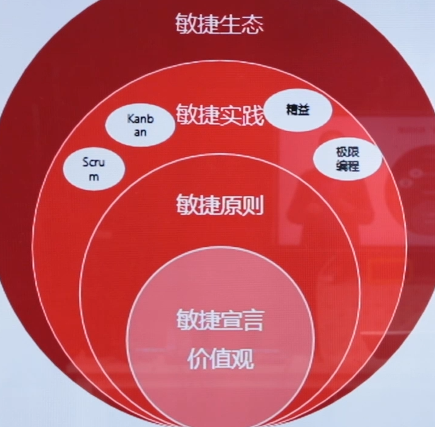

# 敏捷专题课

[TOC]

> **整体框架：**
>
> ​	敏捷原则与理念
> ​	Scrum体系
> ​	精益与kanban体系
> ​	团队管理
> ​	体系总结
>
> **PMP考试中的敏捷特点**
>
> ​	1、题目场景50%是预测型，50%是由混合型和纯敏捷型组成;
> ​	2、题目首先需要准确判断出题目场景，需要了解不同场景的特点和关键词;
> ​	3、混合型场景下不同角色的职责和定位(PM、 PO、SM、开发团队)
> ​	4、混合型和敏捷场景下团队特点和PM领导风格;
> ​	5、敏捷里的名词概念需要理解

## 一、敏捷原则与理念

### 1、STACEY矩阵的启示:

1.识别正确的所在区域
2.选取恰当的应对方法


| Simple                     | Complicated | Complex    | Anarchy                    |
| -------------------------- | ----------- | ---------- | -------------------------- |
| 简单: 接近认同，接近确定性 | 复杂        | 混乱的边缘 | 混乱：远离认同，远离确定性 |

### 2、敏捷的洋葱圈



### 3、敏捷宣言

```
我们一直在实践中探寻更好的软件开发方法，身体力行的同时也帮助他人。由此我们建立了如下价值观:
    个体和互动高于流程和工具
    工作的软件高于详尽的文档
    客户合作高于合同谈判
    响应变化高于遵循计划
也就是说，尽管右项有其价值，我们更重视左项的价值。
```

### 4、12原则

```
1、我们最重要的目标，是通过持续不断地及早交付有价值的软件使客户满意。
2、欣然面对需求变化，即使在开发后期也一样。为了客户的竞争优势，敏捷过程掌控变化。
3、经常地交付可工作的软件相隔几星期或一两个月，倾向于采取较短的周期。
4、业务人员和开发人员必须相互合作，项目中的每一天都不例外。
5、激发个体的斗志，以他们为核心搭建项目。提供所需的环境和支援，辅以信任，从而达成目标。
6、不论团队内外，传递信息效果最好效率也最高的方式是面对面的交谈。
7、可工作的软件是进度的首要度量标准。
8、敏捷过程倡导可持续开发。责任人、开发人员和用户要能够共同维持其步调稳定延续。
9、坚持不懈地追求技术卓越和良好设计，敏捷能力由此增强。
10、以简洁为本，它是极力减少不必要工作量的艺术。
11、最好的架构、需求和设计出自自组织团队。
12、团队定期地反思如何能提高成效，并依此调整自身的举止表现。
```

## 二、Scrum体系

### 1、流程图


### 2、重中之重：3355


#### 2.1、三种角色

##### Product Owner：产品负责人

给团队讲清楚弄明白需求的内容；决定发布日期、发布计划；对团队迭代交付进行确认。

```
客户代表；
定义所有产品功能；
决定产品发布的内容以及日期；
对产品投入产出负责；
根据市场变化对需要开发的功能排列优先顺序；
合理的调整产品功能和迭代顺序；
认同或者拒绝迭代的交付；
确保开发团队知道产品待办事项列表。
```

##### Scrum Master与项目经理

团队开始阶段工作与PM差别不大，团队执行起来要与传统PM切割；
SM与PM最大区别是不做决策。

```
项目早期SM和PM相对统一 (制定规则、 管理期望、管理相关方、制定沟通策略、管理承诺等)；
项目执行起来则SM和PM进行切割(不做决策)；
鼓励言论自由；
保证仪式；
团队有问题，优先内部讨论解决；
保护团队一个整体。
```

##### Dev Team：开发团队

不是传统开发，包括测试实施等人员

```
自主选择（自己选择做什么任务，非wbs拆解分配，主观能动性很强）；
全职能（ABC三人都能做互相的事情，业务、技能都可以，不会因为某个人造成迭代失败）；
跨团队本身不进行解决（问题不在团队内部，而是如外部配合问题，一定要拉着外部团队进行沟通）；
决策在团队内（去中心化决策）；
平级（职能上平级）。
```

#### 2.2三种工件/工具

##### 产品待办事项列表 Porduck Backlong

排了序的需求池

```
产品需求的列表；
包含业务需求、技术需求、NFR(非功能性需求)等；
理想状况下，每一个待完成的工作都将对客户产生价值；
PO对该列表进行优先级排序；
每个迭代开始前，优先级排序还需要再度修正；
*待办事项列表中的条目以用户故事的形式呈现。*
```

##### **迭代待办事项列表 Sprint Backlong**

本次迭代要完成的需求列表

```
产品代办事项列表的子集；
将用户故事拆分成任务，团队成员主动领取任务；
团队成员有共同的迭代目标，为交付可工作的成果而努力；
团队成员可以添加、删减或更改迭代中的任务；
迭代列表中的任务进行了估算，剩余工作量的估计每天需要更新。
```

##### **产品增量 Product Increment**

交付物

```
团队在迭代中完成交付成果，集成到以往的迭代成果中，形成增量式的交付；
每次交付的用户故事必须符合验收条件；
*每次交付的增量成果必须处于可用状态，而不管PO是否决定发布这个用户故事（交付和上线）。*
```

