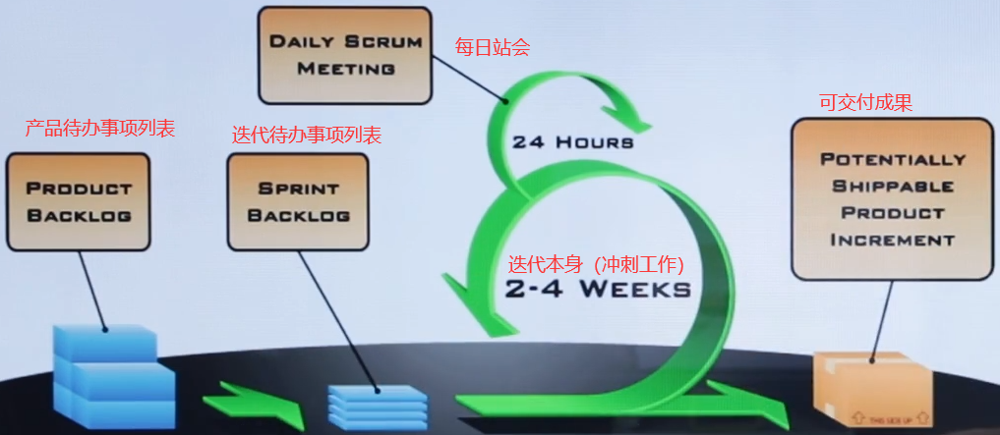

# 敏捷专题课

[TOC]

> **整体框架：**
>
> ​	敏捷原则与理念
> ​	Scrum体系
> ​	精益与kanban体系
> ​	团队管理
> ​	体系总结
>
> **PMP考试中的敏捷特点**
>
> ​	1、题目场景50%是预测型，50%是由混合型和纯敏捷型组成;
> ​	2、题目首先需要准确判断出题目场景，需要了解不同场景的特点和关键词;
> ​	3、混合型场景下不同角色的职责和定位(PM、 PO、SM、开发团队)
> ​	4、混合型和敏捷场景下团队特点和PM领导风格;
> ​	5、敏捷里的名词概念需要理解

## 一、敏捷原则与理念

### 1、STACEY矩阵的启示:

1.识别正确的所在区域
2.选取恰当的应对方法


| Simple                     | Complicated | Complex    | Anarchy                    |
| -------------------------- | ----------- | ---------- | -------------------------- |
| 简单: 接近认同，接近确定性 | 复杂        | 混乱的边缘 | 混乱：远离认同，远离确定性 |

### 2、敏捷的洋葱圈


### 3、敏捷宣言

```
我们一直在实践中探寻更好的软件开发方法，身体力行的同时也帮助他人。由此我们建立了如下价值观:
    个体和互动高于流程和工具
    工作的软件高于详尽的文档
    客户合作高于合同谈判
    响应变化高于遵循计划
也就是说，尽管右项有其价值，我们更重视左项的价值。
```

### 4、12原则

```
1、我们最重要的目标，是通过持续不断地及早交付有价值的软件使客户满意。
2、欣然面对需求变化，即使在开发后期也一样。为了客户的竞争优势，敏捷过程掌控变化。
3、经常地交付可工作的软件相隔几星期或一两个月，倾向于采取较短的周期。
4、业务人员和开发人员必须相互合作，项目中的每一天都不例外。
5、激发个体的斗志，以他们为核心搭建项目。提供所需的环境和支援，辅以信任，从而达成目标。
6、不论团队内外，传递信息效果最好效率也最高的方式是面对面的交谈。
7、可工作的软件是进度的首要度量标准。
8、敏捷过程倡导可持续开发。责任人、开发人员和用户要能够共同维持其步调稳定延续。
9、坚持不懈地追求技术卓越和良好设计，敏捷能力由此增强。
10、以简洁为本，它是极力减少不必要工作量的艺术。
11、最好的架构、需求和设计出自自组织团队。
12、团队定期地反思如何能提高成效，并依此调整自身的举止表现。
```

## 二、Scrum体系

### 1、流程图



### 2、重中之重：3355

