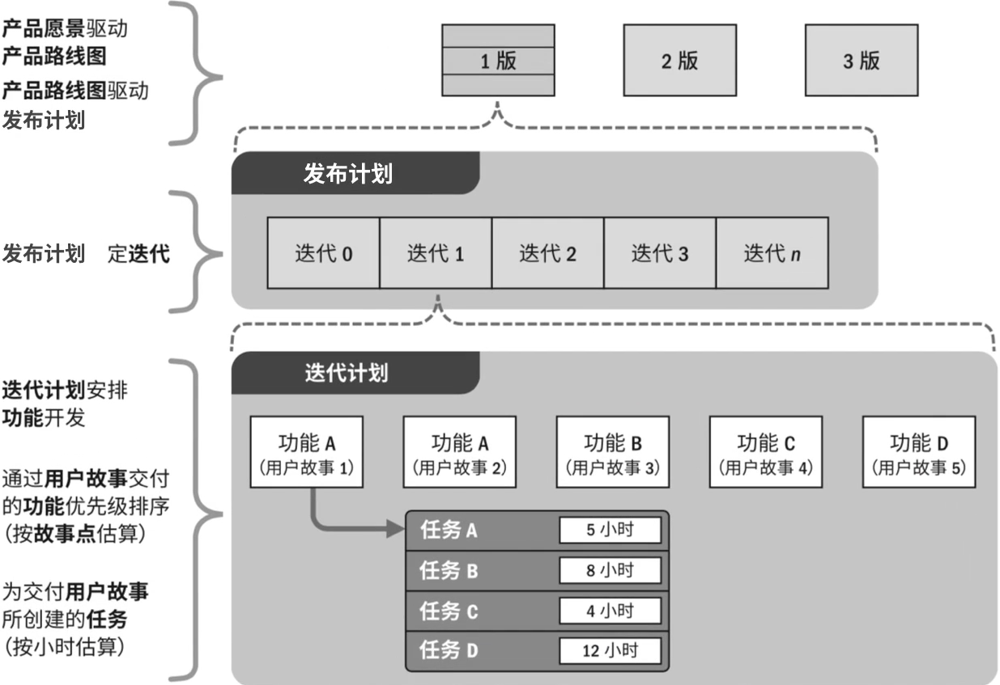

# PMP十大管理

## 一、项目整合管理

### *学习要点

#### 五星

```
9、整体变更控制程序；*****
	4.13流程图默写
```

#### 四星

```
4、项目管理计划和项目文件、区别和联系；****
	管理计划：规则程序文件
	项目文件：具体的数据、信息
5、项目3大基准的来源、用途和变更管理；****
	范围基准、进度基准、成本基准；
	基准变更必须通过CCB走变更控制流程。
6、配置管理的含义，配置管理与变更管理的关系；****
	含义：通过技术或行政手段对产品及其开发过程和生命周期进行控制、规范的一系列措施
	关系：变更管理使配置管理更加严谨、完整
10、合同收尾与行政收尾的区别和联系；****
	合同：完成我们合同内的职责
	行政：面向公司内部，随时记录项目经验教训等信息，交给PMO
	联系：先与外部交接，再与公司内部交接，完成合同收尾后完成行政收尾。
```

#### 三星

```
1、整合的含义，整合的对象，整合的负责人；***
	在很多备选的组件、备选的方法、备选的资源中，挑选最合适的，然后重新组织变成一个有机的整体。；项目经理
2、项目章程由谁发布？谁有权修改？章程的意义？***
	项目发起人；项目发起人；非常重要的，原则上的高层级的定义。
3、项目启动会议与项目开工会议；***
	启动：IM 概念到规划之间
	开工：KOM	计划编制完成即将开始实施
7、显性知识、隐性知识和知识转移；***
	显：易表达、易书面化
	转移：产品说明书、培训、演示
8、工作绩效数据、工作绩效信息和工作绩效报告；***
	数据：执行过程组，干活就产生；
	信息：把数据进行梳理加工，用于我们自己控制项目进度、成本以及其他指标的决策依据；
	报告：把信息进一步加工成可以进行项目重要决策的完整书面报告。
```

### 4.1	 整合管理是什么

```
整合管理是我们项目的总章、是给整个项目管理订了一个规矩。其他所有知识领域都是围绕整合管理制定的准则和规矩展开的。
```

### 4.2	项目章程

项目章程的定义以及三个标志性意义：

```
定义：
1、由项目启动者或发起人发布的。
2、正式批准项目成立。
3、授权项目经理动用组织资源开展项目活动的文件。
意义：
1、项目执行组织与发起组织之间建立起伙伴关系。
2、项目的正式启动。
3、给项目经理正式授权。
```

△ 什么时候任命项目经理：

```
应尽早确认并任命项目经理；
最好制定项目章程时就任命；
最晚也必须在规划开始之前。
```

制定项目章程的过程：详见思维导图

### 4.3~4.4	项目计划

计划的概念

```
通往目标的路线图。
```

项目计划的重要性：

```
确定范围管理、时间约束、质量要求、成本预算、风险识别、相关方与沟通管理。
```

项目计划的必要性：

```
项目的成功，必须要有良好的计划与控制。
```

### 4.5	项目管理计划和项目文件

项目管理计划：

```
规则程序，不能朝令夕改，更新频率很低。	规则程序、项目基准
```

项目文件：

```
记录项目具体的数据和信息，因为项目存在很多的不确定性，所以项目文件要经常的更新。	实施计划、资料文件
```


### 4.6	里程碑计划

里程碑计划

```
非常重要的事件或节点
```

启动会议和开工会议

|    会议    |    项目启动会议    |   项目开工会议   |
| :--------: | :----------------: | :--------------: |
|    英文    | Initiating Meeting | Kick-Off Meeting |
|  所属过程  |    制定项目章程    | 制定项目管理计划 |
| 所属过程组 |     启动过程组     |    规划过程组    |
|   召集人   |     项目发起人     |     项目经理     |

### 4.7	项目管理数据和信息

|        |          工作绩效数据          |           工作绩效信息           |          工作绩效报告          |
| :----: | :----------------------------: | :------------------------------: | :----------------------------: |
| 产生于 |            执行过程            |             监控过程             |            监控过程            |
|  频率  |          极高（随时）          |           较高（定期）           |         较低（按要求）         |
|  用途  |        跟踪记录项目状态        |        分析偏差/预测趋势         |       汇报进展/辅助决策        |
|  对象  |            项目团队            |             项目团队             |     发起人/PMO/高级管理层      |
|  特征  |         是什么（what）         |          为什么（why）           |         怎么办（how）          |
|  举例  | 本周发生成本50万，完成产值75万 | 当前成本偏差±15万，进度偏差-20万 | 拟增加资源赶上进度（挣值报告） |

三种常用的数据分析方法

```
1、备选方案分析：多种方案中选择最优
2、趋势分析：根据已知情况预测未来发展
3、偏差分析：实际执行与计划的偏差
```

### 4.8	管理项目知识

```
显性知识：可以编撰，易于表达。
隐性知识：无法编撰，难于表达。
```

### 4.9	变更应对措施

变更对项目的影响

```
修改项目进度、修改项目预算、修改项目质量要求、修改项目范围、（进城吃饭-进度、成本、质量、范围）、修改项目政策或程序、预防和纠正措施
```

变更时的项目计划更新

```
对基准的变更，只能针对今后的情况，而不能变更以往的绩效。
```

变更发生时的应对措施

```
预防措施：防患于未然
纠正措施：知错就改
缺陷补救：亡羊补牢
```

### 4.10~4.11	配置管理计划

配置管理包含的内容：

```
产品的功能、组件、文档
项目的基准、计划、文件
组织过程资产（知识、经验、教训）
```

配置管理的目标：

```
完整性、一致性、可控性、追溯性
```

*软件配置管理包含：

```
版本管理、变更管理、过程管理、文档管理。
###扩展###
版本管理：版本完整、可控、可追溯
变更管理：标识、控制、报告变更
过程管理：标准、合规、持续改进
文档管理：完整、一致、及时更新
```

软件开发的三种状态：

```
草稿、式发布、正在修改
```

### 4.12	整体变更控制

项目中计划和控制的关系

```
计划是控制的基础，控制是计划的保证。
```

变更控制委员会【CCB】的成员和作用

```
成员：由项目发起人组成的一个常设但非固定的正式团体。
作用：CCB是变更的最高的决策机构
```

### 4.13	整体变更流程图和变更控制的32个原因

```
变更设计关键词
通知——相关方
变更请求——评估影响
书面报告——CCB
```

**流程图**


实施“整体变更控制程序”的32个常见原因


### 4.14	敏捷场景下的变更管理

敏捷场景下的变更管理

```
✳小步快跑、高速反馈、保持节奏、价值交付
运营团队将需求提交给PO（产品负责人）评估这项需求在待办事项中的优先级。
```

产品待办列表DEEP特征

| 优先级 | 颗粒度/细化程度                              | 例如                                                         |
| ------ | -------------------------------------------- | ------------------------------------------------------------ |
| 高     | 细颗粒、详尽的条目，已准备好在下一迭代中实施 | 小型用户故事：今年要做什么，怎么做，都有了详细、规划方案     |
| 中     | 中等颗粒条目，待进一步细化                   | 中大型用户故事：XX年计划，有了目标没确定如何做，计划还不够细致 |
| 低     | 粗颗粒条目，需分解并细化，还可能改变         | 史诗级用户故事：XX发展愿景，没想好则么做，中途有可能直接取消了 |

### 4.15	结束项目或阶段

项目收尾流程

```
1.最重验收➡2.关闭合同➡3.财务收尾➡4.相关方满意度➡5.归档工作➡6.经验教训➡7.庆功会➡8.解散团队
```

|      | 合同收尾                         | 行政收尾                                                     |
| ---- | :------------------------------- | :----------------------------------------------------------- |
| 定义 | 买卖双方完成交接，结清账目       | 企业内部项目收尾程序                                         |
| 时间 | 合同结束时                       | 项目或每个阶段结束时                                         |
| 总结 | 采购审计                         | 回顾，经验教训总结                                           |
| 审批 | 买方向卖方签发书面确认           | 管理层向项目经理签发书面确认                                 |
| 交接 | 与外部卖方/买方交接              | 与公司内部交接                                               |
|      | 最大区别：行政收尾贯穿项目始终。 | 顺序：先与外部交接，再与公司内部交接，完成合同收尾后完成行政收尾 |

知识转移途径

```
产品说明书、培训、演示
```

## 二、项目范围管理

### *学习要点

#### 五星

```
8、确认范围的时间；*****	
	每个阶段结束都要做范围确认。
```

#### 四星

```
1、需求管理计划和范围管理计划、区别和联系；****
	需：管理客户需求（客户需要什么）
	范：我们做什么
	联系：双方达成一致，必要满足的需求才是我们要做的工作。
2、不同类型生命周期范围管理的区别；****
	瀑布型、迭代型、增量开发方式以及敏捷，范围管理用到的方法不同、文件不同、周期不同、用户参与频率也不同；
5、WBS分解的原则和包含的元素；****
	百分百原则：不管分几层，下面这些层所包含的工作内容，必须和上面的那一层所定义的保持一致。
	元素：子项目、控制账户、工作包、规划包
6、WBS账户编码的规则和作用；****
	规则：唯一的编码
	作用：识别某个工作属于整个工作计划当中的第几层，以及它的隶属关系。
10、确认范围与项目验收的关系；****
	确认范围是分期分批的按阶段进行确认，最终的项目验收只剩下一个仪式，不能有大量的还没有确认的可交付成果。
```

#### 三星

```
3、识别需求的常用方法和工具;***
	头脑风暴（畅所欲言集思广益互相启发）
	访谈（一对一）
	焦点小组（对某特定主题）
	问卷调查（量大面广）
	标杆对照（参照物）
	联合应用设计或开发-JAD（客户参与）
4、范围基准包含的文件；***
	范围说明书、WBS：工作分解结构、WBS词典
7、责任分配矩阵RAM的规则；***
	把工作包和团队中的角色进行对应。通过该矩阵进行责任的分配。
9、确认范围与控制质量的关系；***
	每当有一部分可交付成果，先要自己确认质量合格，让后再去向客户确认这是不是他要的内容，如果不是，就需要获得额外的资源去修订，直至满足客户的真实需求。
	
```

### 5.1	项目范围

范围管理的目标、包括、范围

```
目标：（1）要做什么、（2）只做什么
包括：（1）产品范围：产品、服务或成果所具有的特性和功能。	（2）项目范围：为交付产品、服务或成果而必须完成的工作。
范围：确保项目团队、项目发起人和项目相关方 对项目的可交付成果，以及对形成这些可交付成果所进行的工作 达成共识。
```

不同生命周期的范围管理对比

|                 | 预测性（瀑布） | 迭代型/增量型 | 适应型（敏捷） |
| --------------- | -------------- | ------------- | -------------- |
| 定义范围的时间  | 项目开始       | 每个迭代开始  | 随时           |
| 确定范围的时间  | 项目或阶段结束 | 每个迭代结束  | 随时反馈       |
| 范围控制文件    | 范围基准       | 版本配置文件  | 用户故事       |
| 发起人/客户参与 | 里程碑         | 周期性        | 持续性         |

### 5.2	收集需求

需求管理计划

```
规划、跟踪和报告需求；
配置管理活动；
需求优先级排序过程；
确定产品测量指标；
跟踪矩阵的跟踪结构。
```

范围管理计划

```
制定详细范围说明书；
创建WBS和WBS词典；
创建责任分配矩阵；
正式验收可交付成果；
处理对项目范围变更。
```

收集需求的六种方法

```
头脑风暴（畅所欲言集思广益互相启发）
访谈（一对一）
焦点小组（对某特定主题）
问卷调查（量大面广）
标杆对照（参照物）
联合应用设计或开发-JAD（客户参与）
```

### 5.3	收集需求的常用工具

头脑风暴+亲和图

```
亲和图：根据亲和性把所有需求进行重新的整理归类，同一类的需求有相关性，方便进行下一步分析。
```

质量功能展开+思维导图

```
QFD质量功能展开：设计要求（产品规划矩阵）➡零件特性（零件规划矩阵）➡工艺要求（工艺规划矩阵）➡生产要求（工艺/质量规划矩阵）
```

### 5.4	需求决策与表现

决策的方法

```
投票与独裁
多标准决策：根据准则分配权总打分，分值X权重
亲和图 和 思维导图
```

### 5.5	人际关系与团队技能

包括

```
名义小组：小组成员先不通气独立思考➡各自写下备选方案和意见➡轮流陈述➡投票➡票数多入选➡管理者有一票否决权；
观察法
引导式研讨会：跨部门跨专业结合大家意见做分析。主持人引导发言。
```

### 5.6	系统交互图和原型法

系统交互图


原型法：原型设计，仿真效果无代码

故事版：可视化剧本

### 5.7	需求文件与需求跟踪矩阵

需求跟踪矩阵


### 5.8~5.9	敏捷场景下的需求管理

产品属性（卡诺模型）


精益画布


MMR（最小可发布版本）+MVP（最小可行性产品）

```
MMR（最小可发布版本）：可以付钱买的产品
MVP（最小可行性产品）：不一定是真实产品
```

莫斯科法则+待办列表

```
莫斯科法则：对用户需求优先级进行排序（必须有、应该有、可以有、不该有），使我们知道应先做什么。
产品待办列表：PO（产品负责人） 负责；优先级、事项、初始规模估算 （一般有的指标）
```


WSJF原则（最短作业优先原则）

```
两个维度：横轴-时间；纵轴-延迟代价
延迟满足的代价=单位延迟代价/历时
```


### 5.10	用户故事 和用户故事地图

用户故事

```
作为一个<角色>，我想要<活动>，以便于<商业价值>。
作为一个<微信用户>，我想要<自动同步头像>，以便于<统一网络形象>。
```

用户故事地图

```
两个维度
	业务流程（时间线）
	商业价值（优先级）
```


### 5.11	项目范围说明书

项目章程与项目范围说明书的关系

```
章程：粗略的概括性的纲领性的要求
说明书：具体的详细定义
关系：渐进明细
```

### 5.12	WBS工作分解结构

```
子项目、控制账户、工作包/规划包（占空）（活动、任务）
项目经理管控最低层级为：工作包
```

### 5.13	WBS词典

```
针对每个WBS组件，详细描述可交付成果活动和进度信息的文件。
```

### 5.14	RAM责任分配矩阵

```
每一项任务必须又唯一的负责人，可以有多个参与者。
```


WBS工作分解结构价值

```
基准的来源、计划的基础、工作的展现、控制的依据、团队的指南。
```

### 5.15	确认范围

```
定义：每完成一项可交付成果，都应及时与甲方进行确认，以确保交付成果满足客户要求。
```

### 5.16	如何防止范围蔓延

```
定义：范围发生改变，没经过变更控制程序，而产生的不良的影响。
范围镀金：客户没要求，自行增加非必要功能（主动）
范围爬行：客户朝令夕改，频繁变更需求（被动）
共同点：范围基准都发生了改变，都没经过变更控制程序。消耗的时间和资源未必得到客户认可。
```

### 5.17	范围蔓延该怎么办

镀金和爬行的解决方法；

```
镀金：避免讨好客户、配置强迫症、秀才艺
爬行：建立规范的变更控制流程
```

## 三、	进度管理

### *学习要点

#### 五星

```
6、关键路径法的原理和应用；*****
	含义：确定项目总工期的路径（时间加起来最长的路线）
7、应急储备与管理储备；*****
	应急：已知-未知风险；项目经理管理。
	管理：未知-未知风险；高级管理层管理。（不包含在成本基准或进度基准中）
8、自由浮动时间与总浮动时间；*****
	自浮：不影响后面活动前提下，这个活动自有的余地。
	总浮：所有自由浮动时间加起来；只要不超出这个时间，总工期就不影响。
```

#### 四星

```
3、活动依赖关系；****
	开始S、结束F 的四种关系：F-S、S-S、F-F、F-S；（活动和活动间可能没关系，如果有必然四种之一）
4、滞后量（lag）与提前量（lead）；****
	lag：一个工作完成时，在计划中就预留了一个等待时间，让我们更好的应对一些不确定性。
	lead：把后面的工作提前开始和前面的工作时间上搭接，是为了提前工期。
5.活动历时估算的方法和优缺点；****
	类比法：省时省力；未必准确。
	专家判断：直接、高效；可能存在偏见、判断失误
	三点估算：较精准；较好费资源
	自下而上估算：精确度高；周期长成本高
9、资源平衡与资源平滑；****
	平衡：通过对进度的修改，解决某一段时间内多项活动，同时用到同类资源过多，资源不够的问题。
	平滑：通过利用非关键路径上的浮动时间，向前先后挪动某些工序某些活动，能够让资源的波动减少，也就是削峰填谷。利用用有限的资源发挥最大潜力。（也能压缩工期）
10、快速跟进和赶工（有且只有的两种压缩工期方法）****
	快跟：后续的工作提前做，提前开始和前面的工作搭接；时间会缩短，可能因前面工序问题而返工，从而影响后面更多活动跟着返工。
	赶工：投入更多资源，如增加人手、加班；工期缩短，
```

#### 三星

```
1、进度计划模型的含义；***
	通过左边的工具方法与右侧的数据结合构成进度开发的模型，有任何进度相关的新数据，模型就产出一套新的进度计划。
2、具有未完成项的进度计划和按需进度计划；***
	主要指敏捷中，需求会源源不断产生，我们只需考虑这一个冲刺中，完成哪几项工作。待办事项列表未开发的都叫未完成项。清空代办列表才是终止。 （不理解）
```

### 6.1	时间的特征

时间的特征

```
时间不等人
投入有上限
对谁都公平
```

敏捷开发中产品需求的来源

```
团队创意
用户反馈
```

### 6.2	看板动画

敏捷常用工具：看板

```
待办、分析、设计、开发、测试、完成
拉动式生产、核心实践：
1、可视化流程：为每一个工作项创建一个卡片
2、限制在制品：
3、管理和度量流动：
4、显示化流程规则：
5、建立反馈环路：
6、协作式改进：
```

### 6.3	洋葱圈规划

洋葱圈规划


时间管理的过程

```
1、规划进度管理
2、定义活动
3、排列活动顺序
4、估算活动持续时间
5、制定进度计划
6、控制进度
```

敏捷发布的规则

```
具有未完成项的迭代进度计划
```



滚动式开发规则

```
要完成的工作：
近期：详细规划；
中期：渐进明细、从粗到细；
远期:只做概要性规划（规划包）；
```

### 6.4	紧前关系绘图法PDM

PDM四种逻辑关系

```
FS:结束-开始
SS:开始-开始
FF:结束-结束
SF:开始-开始
```

项目中的两种依赖关系

```
内部依赖：项目活动之间的四种依赖关系
外部依赖：外部一些条件不具备，项目上很多工作没法运行
```

### 6.5	滞后量和提前量

```
滞后量lag：FS+3	当前活动结束后，等待三天，再进行下一个活动
提前量lead：FS-2 当前活动结束前两天，就开始下一个活动
```

前导图项目管理中的应用

```
将所有互动画在一幅图上，用箭头代表活动间的逻辑关系。
```

### 6.6	估算资源

学习曲线

```
概念：
随着产出数量增多，单位产出所需劳动时间会减少，单位生产成本会降低。
有经验的人完成一项工作所需要的时间和新手是不一样的。
```

边际效益递减规律

```
在其他条件不变的情况下,如果一种投入要素连续地等量增加,增加到一定产值后,所提供的产品的增量就会下降,即可变要素的边际产量会递减。
```

资源直方图

```
单位时间所需要的资源数量。
```

### 6.7~6.11	五种估算方法

三点估算

```
期望值te	乐观值O	最可能M	最悲观P
贝塔分布（PERT技术）：te=（O+4M+P）/6
三角分布：te=（O+M+P）/3
标准差=（P-O）/6
正态分布：期望值完成率50；左右一个标准差-68.26 ； 两个95.46 ；	三个99.73
```

优缺点

| 方法     | 优点               | 缺点                   |
| -------- | ------------------ | ---------------------- |
| 专家判断 | 直接、高效         | 可能存在偏见、判断失误 |
| 类比估算 | 经济高效、省时省力 | 未必准确               |
| 参数估算 | 省时、准确         | 模型成熟，参数准确     |
| 三点估算 | 精准度较高         | 成本较高               |
| 自下而上 | 精确度高           | 周期长成本高           |

详细对比

|             | 类比估算 | 参数估算 | 专家判断 | 三点估算 | 自下而上 |
| ----------- | -------- | -------- | -------- | -------- | -------- |
| 成本        | 低       | 低       | 低       | 较高     | 高       |
| 准确度      | 低       | ——       | ——       | 较高     | 高       |
| 活动        | √        |          | √        | √        |          |
| 工作包      | √        | √        | √        | √        | √        |
| 子项目/项目 | √        | √        |          | √        | √        |

敏捷估算扑克

```
已一个标准值定基，全员出牌完成一个活动需要几个标准值，每次让首尾数解释，几轮下来，大家给出的数值趋近相同，取大的。
```

### 6.12~6.13	储备分析

进度储备

```
活动与活动之间，故意留下的空档。
```

项目风险的分类及含义

| 类型          | 风险事项 | 发生概率 | 造成影响   |
| ------------- | -------- | -------- | ---------- |
| 已知风险      | 已知     | 已知     | 可事先评估 |
| 已知-未知风险 | 已知     | 未知     | 未知       |
| 未知-未知风险 | 未知     | 未知     | 未知       |

应急储备和管理储备应对不同的风险

| 应急储备      | 管理储备       |
| ------------- | -------------- |
| 项目经理支配  | 高层管理者支配 |
| 已知-未知风险 | 未知-未知风险  |
| 成本基准内    | 成本基准外     |

### 6.14~6.15	进度计划

展现工具：里程碑计划

```
计划：分解为阶段性目标；
控制：强制约束，控制各阶段目标实现；
沟通：与管理层、干系人良好沟通
责任：明确规定了项目各方的责任义务；
报告：简明、生动、通俗、易用。
```


展现工具：横道图/甘特图

```
优点：直观形象、通俗易懂
缺点：无法识别哪些活动在关键路径或非关键路径上，以及每个活动的浮动时间。
```

单代号网络图（AON；四种逻辑关系）

双代号网络图（AOA；仅FS一种逻辑关系；虚线代表虚活动，不消耗时间与资源，仅表示逻辑关系）


时标网络图（双代号+时间）


进度前锋图（时标网络图+蓝线：当前时间+红线：实际完成）


### 6.17~6.20	关键路径法CPM+自由/总/项目浮动时间

含义与规则

```
确定项目总工期的路径（时间加起来最长的路线）
EF=ES+DU
浮动时间≤ 0 或＞0的特征活动都可能在关键路径上

总浮动时间：是指在不延误项目完成日期或违反进度制约因素的前提下，某进度活动可以推迟的总时间量(从其最早开始日期起算)
【本活动自由浮动时间+后续所有活动自由浮动时间，，，只要不影响总工期即可。】
总浮动时间 = 最晚开始时间-最早开始时间	TF=LF-EF	或	最晚完成时间-最早完成时间	LS-ES

自由浮动时间：可以在不推迟任何后续活动的最早开始时间的情况下本活动可以推迟的时间。
自由浮动时间= (后续活动的最早开始时间) - (本活动的最早完成时间)	后续ES（多个紧后选最小）-本活动ES

项目浮动时间：总工期基础之上，甲方/领导主动增加的时间。

举例：一桌四个人；个人椅子不碰到其他人前提下，可以自由挪动的面积（自由浮动）；再加一个人，大家围着同一桌子周长（总工期）各自挪动出的空间加起来的面积（总浮动）
```


关键路径七类考点

```
1.关键路径决定了项目的总工期;
2.关键路径所需要的时间最长;
3.关键路径上的浮动时间最少;
4.一个项目关键路径可以有多条;
5.关键路径上的活动总耗时最长，技术含量未必高;
6.活动延误可能导致关键路径变化;
7.关键路径上活动的工期可以通过“赶工、快速跟进” 两种方法压缩;
```

### 6.21~6.22	关键链法CCM

```
关键链法：每个人按三点估算的期望值报工期，在路径汇聚前留“接驳缓冲”，最后项目经理留“项目缓冲”。
路径汇聚：一个活动有多个紧前活动，造成按时影响因素太多，有很大即定时间无法完成风险、
/**
学生综合征/拖延症/帕金森定律：工作会自动膨胀，沾满所有可用时间。
估算安全时间：每个环节估完后都加安全时间，一级一级增加，造成安全时间过场。
墨菲定律：工作全都比你估计的时间要长；你越担心的事请，月可能发生。
*/
```


### 6.23	关键链与关键路径区别 CCM&CPM

```
关键路径法：将项目全部资源事先分配给各活动，每个活动都留富余。
关键链法：每个活动都不要留富余，所有储备放到储备池中，那个活动需要再分配给他。
```

### 6.24	资源优化

```
资源平衡：解决某个时间资源不够的局部问题，但可能导致工期延长。
资源平滑：利用非关键路径的浮动时间，错开一些活动并行的情况，让项目资源减少波动，起到削峰填谷的作用。
```

### 6.25	进度压缩（缩短工期）

```
快速跟进：FS-3，多个工作并行；增加后续工作返工风险；
赶工：增加资源；增加项目成本；
```

### 6.26	燃尽图（常用于敏捷控制版本）


## 四、	成本管理

### *学习要点


#### 五星

```
3、项目预算的组成*****
	应急储备在成本基准内，管理储备不在；成本基准+管理储备=项目预算
6、挣值分析两个偏差和两个指数*****
	CV：成本偏差
	SV：进度偏差
	CPI：成本绩效指数
	SPI：进度绩效指数
9、完工估算EAC与完工尚需估算ETC*****
	EAC=AC+ETC
```

#### 四星

```
5、挣值分析三个指标的含义与关系****
	PV：计划值
	AC：实际成本
	EV：挣值
```

#### 三星

```
1、成本的分类***
	直接成本&间接成本	
	固定成本&可变成本
	机会成本：	沉没成本：
	全生命周期成本：
2、盈亏平衡分析***
	产出到多大规模可以覆盖成本，再往后开始盈利。
4、资金限制平衡***
	量入为出：必须要考虑资金的来源，以及资金进来的时间，确保成本花费在资金来源覆盖范围内。
7、挣值曲线***
	从三条曲线分析绩效状况、根据趋势预测未来成本，以及工期发展趋势
8、完工预算BAC与项目预算PB关系***
	BAC不包含管理储备，PB=BAC+管理储备
10、挣得进度ES***
	从时间维度用挣值分析的参数去评估，我们所做工作对应时间是否真的被甲方认可。
```

### 7.1~7.3	成本分类、盈亏平衡分析

```
直接成本&间接成本	
固定成本&可变成本
机会成本：多个方案中，选择一个，放弃的机会中收益最高的。	
沉没成本：已经付出，无法得到回报。
全生命周期成本：项目开始到最终项目结束
盈亏平衡：销售收入覆盖所有成本
```

### 7.4	敏捷场景成本管理

```
最小可用产品【MVP】：让客户在每个阶段都有产品可用；	思路：介绍视频、仿真、众筹、原型法、预售
```

### 7.5	成本估算与预算

成本估算精确度等级

| 估算级别      | 项目阶段 | 目的       | 常用方法 | 估算精确度  |
| ------------- | -------- | ---------- | -------- | ----------- |
| 粗略级估算ROM | 启动阶段 | 可行性研究 | 类比估算 | -25% ~ +75% |
| 预算级估算    | 规划阶段 | 编制预算   | 自下而上 | -10% ~ +25% |
| 确定性估算    | 规划阶段 | 签订合同   | 自下而上 | -5% ~ +10%  |

资金限制平衡

```
花的钱与资金到账时间，识别资金限制与计划支出的差异。
```


项目预算的组成


### 7.6	挣值分析，三个指标

```
PV（计划值）=计划单价X计划工作量
AC（实际成本）=实际单价X实际工作量
EV（挣得值）=计划单价X实际工作量
```

### 7.7	两个偏差  SV CV

```
进度偏差SV=EV-PV	SV<0:进度落后  SV>0：进度超前
成本偏差CV=EV-AC	CV<0:成本超支  CV>0：成本节约
（EV越大越好）
```

### 7.8	挣值分析，挣值曲线及六个情况

| 状态         | CV   | SV   | 成本效率 | 宜采取措施                                       |
| ------------ | ---- | ---- | -------- | ------------------------------------------------ |
| AC > EV > PV | < 0  | > 0  | 较低     | 降低成本，提高成本效率。                         |
| EV > AC > PV | > 0  | > 0  | 较高     | 可适当抽调一部分人员加速其他进度较低的项目进展。 |
| AC > PV > EV | < 0  | < 0  | 很低     | 即使预警，全面强化成本绩效管理，必要时变更基准。 |
| EV > PV > AC | > 0  | > 0  | 很高     | 可以根军需要提前结束项目，或释放部分资源。       |
| PV > EV > AC | > 0  | < 0  | 较高     | 加大资源投入，采取激励措施，加速项目进展速度。   |
| PV > AC > EV | < 0  | < 0  | 较低     | 强化监督考核，加速项目，同时控制成本。           |

### 7.9	两个指数 S/CPI

```
成本绩效指数=挣得值/实际成本 CPI=EV/AC	CPI<1:成本超出预算	CPI>1:成本小于预算
进度绩效指数=挣得值/计划值	SPI=EV/PV	SPI<1:进度小于计划	SPI>1:进度超出计划
CPI&SPI都是越大越好
```

### 7.10	完工估算 EAC

```
PB:项目预算
BAC:完工预算
EAC:完工估算
ETC:完工尚需估算
```

### 7.11	完工估算的计算

```
EAC=BAC/CPI 按现在实际单价继续知道完成项目（成本不纠正）
EAC=AC+(BAC-EV)	之前的既往不咎，接下来按计划单价完成（成本纠正）
EAC=AC+[(BAC-EV)/(CPI*SPI)]	后半段成本和进度都按当前状态继续，直到完成项目（成本、进度都不纠正）
```

### 7.12	完工尚需绩效指数 TCPI

```
TCPI=(BAC-EV)/(BAC-AC) 剩余工作/剩余成本
TCPI=(BAC-EV)/(EAC-AC) 剩余工作/剩余估算成本
```

```
完工偏差=完工预算-完工估算 VAC=BAC-EAC
```

### 7.13~7.14	挣值分析案例&应用难点

EV计算规则

```
纯百分比：65%
开始就视为完成一半：50：50
开始视为完成20% ： 20：80
全部完成才计入：0：100
里程碑
主材消耗
```

7.15	挣得进度

```
ES：当前挣值EV，在计划中预计需要完成的时间。
```

## 五、	质量管理

### *学习要点

#### 五星

```
3、持续改进*****
	爱德华。戴明 戴明环、PDCA计划执行检查改进 循环，质量不断改进
4、QA过程保证与QC质量控制区别*****
	QA注重过程合规 QC注重结果合格
7、根本原因分析及鱼骨图*****
	人机料法：人工、机械、材料、方法
```

#### 四星

```
5、质量成本COQ的区别****
	一致性成本注重预防，非一致成本是补救和纠错。
6、质量审计****
	通过审计确保质量管理的过程合规，和事先定义的质量管理计划保持一致。
8、控制图****
	样本不许在控制线范围内，且不能连续七个点在控制线一侧、连续七个点呈上升/下降趋势、不能有点超出控制线。
10、质量管理观念的改变****
	重点在设计与预防，缺陷减少成本降低。
```

#### 三星

```
1、等级与质量的区别和联系***
	等级低不一定不行，质量低一定是个问题。
2、准确度与精准度***
	精：样本之间距离小	准：样本与目标距离小
9、从直方图看问题原因***
	双侧无余量：产品规格与范围一致，没有余量，一有变动就会超出范围，应减少偏差
	两边过富裕：工序能力太富裕，应放宽工序能力降低成本。
	平均值偏离：平均值过于偏向左/右，应调整工序，使工序中心居中。
```


### 8.1	等级与质量、精确度与准确度

```
准确度：样本和目标的距离小
精确度：样本之间相互的距离小
```

### 8.2	质量管理的水平、质量管理的发展

水平的内容

```
由高到低
TQM全面质量管理：全员参与的质量管理文化
DFX设计优化：质量融入规划设计中
QA过程保证：过程的保证和持续改进
QC检查和纠正：检查结果和纠正缺陷来控制质量
用户发现缺陷：代价最大，商誉和口碑受损
```

发展的历程

```
工匠自检→专职质检→QC质量控制→QA过程保证→DFX设计优化→TQM全面质量管理
```

### 8.3~8.5	质量管理的发展趋势和代表人物

| 趋势                           | 代表         | 核心思想                     | 贡献                                                    |
| ------------------------------ | ------------ | ---------------------------- | ------------------------------------------------------- |
| 一：客户满意                   | 朱兰         | 符合要求、适于使用           | 定义了等级和质量的区别和联系；	TQM全面质量管理奠基者 |
| 二：持续改进                   | 爱德华。戴明 | 持续质量改进                 | 戴明环：PDCA循环（计划→执行→检查→改进）                 |
| 三：管理层的责任               |              |                              |                                                         |
| 四：与供应商持续合作，互利共赢 |              |                              |                                                         |
|                                | 克劳斯比     | 质量产生于预防，而不是评估。 | 零缺陷之父                                              |
|                                | 田口玄一     | 质量偏离目标值越大，损失越大 | 品质工程奠基人                                          |
|                                |              |                              |                                                         |

质量成本

| 一致性成本（避免失败花费资金）（预防）    | 不一致成本（由于失败花费的资金）（纠正） |
| ----------------------------------------- | ---------------------------------------- |
| 预防成本：培训、文件u工程、设备、完成时间 | 内部失败成本：返工、报废                 |
| 评估成本：测试、破坏性试验损失、检查      | 外部失败成本：债务、保修工作、失去业务   |

### 8.6	质量矩阵图

两个质量管理工具

​	矩阵图


​	流程图


质量保VS质量控制的区别

|          | QA质量保证（过程合规） | QC质量控制（结果合格） |
| -------- | ---------------------- | ---------------------- |
| 过程组   | 执行                   | 监控                   |
| 对象     | 过程                   | 结果                   |
| 目标     | 合规                   | 合格                   |
| 工具技术 | 分析、审计             | 检查                   |

### 8.7	面向X设计

```
DFX设计优化：质量融入规划设计中；在设计时充分考虑一切。
```

### 8.8~8.11	质量管理工具

根本原因分析

```
质量除了问题可以追根溯源找到产生这个问题的根本原因。
```

鱼骨图（因果图/石川图）（人机料法）

z

直方图/柱状图

```
1、基本符合正态分布；
2、数据全部在规格以内；
3、均值和规格的中心一致；
4、规格线位于基准差四倍的未知。
```


质量不好的直方图


散点图

```
通过变量之间的关系性来分析质量问题产生的原因。看因素和最终结果知道到底有没有关系
```


帕累托图

```
二八原则：80%的问题是由20%的原因造成的。
```


统计抽样(略)

控制图

```
（将直方图横过来，上下各4个西格玛，3个西格玛作为控制线）
以下三种情况需要调整后再继续工作
①连续7点出现在均值一侧；
②连续7点呈单调上升/下降趋势；
③数据出现在控制线外。
```


层别法/数据分层法（人机料法环【环境】）

质量管理七工具

```
鱼骨追原因
检查集数据
直方显分布
控制找异常
帕累托重点
散点看相关
层别做解析
```

### 8.12	过程决策程序图

控制质量的主要作用

```
①识别过程低效或产品质量低劣的原因，建议并/或采取相应措施消除这些原因；
②确认项目的可交付成果及工作满足主要相关方的既定需求，足以进行最终验收。
```

过程决策程序图PDPC


### 8.13	质量管理观念改变

|      | 以前的观念       | 现在的观念       |
| ---- | ---------------- | ---------------- |
| 定义 | 好，优，美       | 与要求一致       |
| 制度 | 缺陷减少成本增加 | 缺陷减少成本降低 |
| 标准 | 合格             | 零缺陷           |
| 测量 | 检验指标         | 质量成本COQ      |
| 重点 | 检查、测试       | 设计、预防       |

## 六、	企业资源管理

### *学习要点

#### 五星

```
2、团队章程*****
	定一个统一的规则，让大家无障碍的沟通，有共同价值观。
5、塔克曼阶梯理论*****
	形成、震荡、规范、表现、遣散 
	规律：发展的规律可能产生反复、阶段跨越会发生在老团队身上
	士气：中-低-中-高
	绩效：最低-低-中-高
9、冲突的物种解决方法*****
	强制/命令；合作/解决；缓和/包容；撤退/回避；妥协/调解；
```

#### 四星

```
3、培训的职责****
	多个管理者都有责任，如人力、职能、项目
6、团队不同阶段项目经理的领导风格****
	形成-直接、震荡-影响、规范-参与、表现-授权
7、团队绩效评价与项目绩效评价****
	团队：执行过程组针对人		项目：监控过程组针对事
8、冲突的积极意义****
	促进磨合，增进了解；灵感源泉，创新动力；暴露问题，降低风险；加速决策，改进管理。
10、人员遣散计划****
	提升士气、控制成本、降低风险
```

#### 三星

```
1、自组织团队的特点***
	去中心化、人人平等、决策和解决问题靠大家协商
4、获取资源中谈判的含义***
	项目经理和资源提供者谈判，便于争取更好的资源。
```

### 9.1	理解资源管理

资源管理的过程

```
规划资源管理
估算活动资源
获取资源
建设团队
管理团队
控制资源
```

权力矩阵


项目人力资源的特点

```
临时性、流动性、松散性、复杂性
```

### 9.2	规划资源管理——项目与企业的人力资源管理的区别

区别

| 企业                 | 项目               |
| -------------------- | ------------------ |
| 选：选拔，如校招社招 | 借：借调           |
| 用：安排合适的岗位   | 用：安排合适的岗位 |
| 育：培养             | 育：培养           |
| 留：将人才留下了     | 还：遣散           |

团队章程与培训责任

```
团队价值观
沟通指南
决策标准和过程
冲突处理过程
会议指南
团队共识
```

### 9.3	资源分解结构

资源分解结果（RBS）的含义和用法

```
含义：将项目上用到的各种资源进行梳理和逐级的分解并编号；
用法：将资源编号与WBS中的编号对应，责任到人。
```

预分派的概念

```
事先预定的无法替代的资源
```

谈判的含义

```
项目经理和资源提供者谈判，便于争取更好的资源。
```

### 9.4	资源获取

获取资源

```
狗队友、野狗队友、兔子队友都不能要
提升自己，影响他人
```


### 9.5	建设团队——塔克曼阶梯理论

```
形成、震荡、规范、表现、遣散
规律：发展的规律可能产生反复、阶段跨越会发生在老团队身上
两个指标：团队士气、团队绩效
```


### 9.6	项目经理管理风格

| 阶段 | 型     | 工作               |
| ---- | ------ | ------------------ |
| 形成 | 指令型 | 直接、明确、清晰、 |
| 震荡 | 影响型 | 引导、斡旋、调解、 |
| 规范 | 参与型 | 帮助、参与、促进   |
| 表现 | 授权型 | 信任、授权、支持   |

### 9.7	敏捷场景下的管理团队

团队绩效评价VS项目绩效评价

|            | 团队绩效评价 | 项目绩效评价             |
| ---------- | ------------ | ------------------------ |
| 针对       | 人：项目团队 | 事：项目进度、成本等指标 |
| 标准       | 团队有效性   | 计划吻合度               |
| 过程组     | 执行过程组   | 监控过程组               |
| 方法（例） | 回顾会议     | 挣值分析                 |

有效项目团队VS无效项目团队

| 有效团队                 | 无效团队                 |
| ------------------------ | ------------------------ |
| 具有共同的目标           | 每个人对目标的理解不一致 |
| 分工明确，优势互补       | 彼此排斥，单打独斗       |
| 顺畅的沟通，主动分享     | 职责不清，专业重复或缺位 |
| 喜欢在一起工作，互帮互助 | 冲突和不良的竞争         |
| 凝聚力强，彼此信任       | 沟通障碍，没有效率的会议 |
| 总能按计划达成目标       | 挫折，无畏的返工         |
| 1+1>2                    | 1+1<2                    |

### 9.8	团队管理——冲突管理

冲突管理及冲突管理的益处

```
冲突是难免的
益处：
促进磨合，增进了解；
灵感源泉，创新动力；
暴露问题，降低风险；
加速决策，改进管理。
```

### 9.9~9.10	团队管理——冲突的解决方法

| 方法      | 适用           |
| --------- | -------------- |
| 强迫/命令 | 紧急、重要     |
| 合作/解决 | 不紧急、重要   |
| 缓和/包容 | 不紧急、不重要 |
| 撤退/回避 | 不紧急、不重要 |
| 妥协/调解 | 紧急、不重要   |

### 9.11	控制资源——人员遣散计划

```
控制成本、提升士气、降低风险、
```

### 9.12	人力资源管理理论——X-Y理论、需求层次理论

x-y：

```
性本恶-性本善
```

需求层次：

```
1、生存：空气/水/食物
2、安全：安全/次序/自由
3、社会：爱情/友情/归属
4、尊重：自尊/成就/责任
5、自我实现：不讲回报/心甘情愿
```

### 9.13	人力资源管理理论——双因素理论、期望理论

双因素

```
保健因素：必要条件
激励因素：成长和发展的机会
```

期望理论：满足以下三点产生才激励效果

```
1、通过努力就能达到
2、绩效达标客户获得奖赏
3、潜在结果或奖赏有吸引力
```

## 七、	项目沟通管理

### *学习要点

#### 五星

```
5、沟通路径*****
	计算：N(N-1)/2
6、沟通方式*****
	交互式、推式、拉式三种优缺点
```

#### 四星

```
1、沟通占用项目经理的精力****
	75~90的经理沟通上
3、沟通模型的含义****
	双向沟通，即接收方向发送方进行反馈，以减少沟通过程中的损失。
```

#### 三星

```
2、沟通模型***
4、沟通漏洞***
	100-80-60-40-20
	改善：减少沟通层级，单向沟通改为双向沟通。
```

### 10.1	有效的沟通

沟通的效果

| 载体           | 文字  | 语音          | 视频     | 见面       |
| -------------- | ----- | ------------- | -------- | ---------- |
| 例子           | Email | 电话/语音聊天 | 视频通话 | 一起喝咖啡 |
| 信息内容       | √     | √             | √        | √          |
| 语音/语速/语调 |       | √             | √        | √          |
| 口型/眼神/表情 |       |               | √        | √          |
| 着装/姿态/手势 |       |               |          | √          |

有效的沟通

```
正确的形式、在正确的时间把信息提供给正确的受众，并且使信息产生正确的影响。
```

### 10.2	书面沟通的5C原则

```
正确的语法和拼写；
简洁的表达和无多余字；
清楚地目的和表述（适合读者需要）；
连贯的思维逻辑；
受控的语句和想法承接；
```

### 10.3	规划沟通需要考虑的要素、沟通模型

考虑要素

```
谁需要这些信息和谁有权接触这些信息；
他们什么时候需要信息；
信息应存储在什么地方；
信息应以什么形式存储；
如何检索这些信息；
是否考虑时差、语言障碍和跨文化因素。
```

沟通模型（噪音泛指一切影响沟通的因素）


沟通漏洞

```
你先说的	100%
你表达的	80%
他听到的	60%
他听懂的	40%
他做到的	20%
```

### 10.4	沟通路径

路径

```
两个人之间算一条路径	多人=N*（N-1）/2
```

过滤

```
大量信息在自下而上或自上而下的沟通过程中损失掉的现象
```

### 10.5	影响沟通的障碍

| 序号 | 障碍                 | 例如                                  |
| ---- | -------------------- | ------------------------------------- |
| 1    | 信息过载             | 同一时间接收过多指令                  |
| 2    | 缺少知识             | 双/单方对沟通的内容缺少足够的知识储备 |
| 3    | 文化差异             | 双方有各自的文化背景                  |
| 4    | 分散注意力的环境因素 | 大排档等嘈杂环境                      |
| 5    | 有害的态度           | 对某些事/人有成见                     |
| 6    | 情绪                 | 负面/有害情绪会迅速扩散               |
| 7    | 不懂专业或技术术语   | 沟通方知识结构知识背景不一样          |
| 8    | 沟通渠道过多         |                                       |
| 9    | 选择性认知           | 都喜欢表扬不喜欢批评，多鼓励少批评    |

产生障碍的原因

```
不同关系人对项目目标的理解不同；
人力、设备、材料等资源的竞争；
人员之间的个人冲突；
对变化的抵制（如新技术、新流程）
```

### 10.6	沟通技巧和方式

技巧

```
简化运用语言；
视觉辅助手段；
积极倾听；
有效的反馈；
情绪控制。
```

方式

| 沟通方法   | 特征                                   | 优点                             | 缺点                                     | 举例 |
| ---------- | -------------------------------------- | -------------------------------- | ---------------------------------------- | ---- |
| 交互式沟通 | 在两方或多方之间进行实时多向信息交换   | 实时互动、沟通充分、反馈及时     | 规模受限，人数增加沟通效果和效率快速下降 | 会议 |
| 推式沟通   | 像需要接受信息的特定接收方，发布或推送 | 确保信息以定向发出               | 无法保证接受、无法保证理解               | 信件 |
| 拉式沟通   | 信息量大且复杂，请庞大受众自行取阅     | 信息量大且受众多，需求方各取所需 | 无法保证接受、无法保证理解               | 订阅 |

### 10.7	会议管理的学问

| 会议                     | 管理                         |
| ------------------------ | ---------------------------- |
| 准备并发布会议议程       | 切题                         |
| 在规定的时间开始和结束   | 处理会议中的期望、问题和冲突 |
| 确保适当参与者受邀并出席 | 记录所有行动及其负责人       |

## 八、	项目风险管理

### *学习要点

#### 五星

```
7、风险应对的策略*****
	通用：上报、接受；
	负面：规避、转移、减轻；
	正面（机会）：开拓、提升、分享。
8、风险应对的方法*****
	应急方案（方案B）
	弹回计划（保底）
	权变措施（随机应变）
9、风险和储备的关系*****
	已知：活动预算
	已知-未知：应急储备
	未知-未知：管理储备
```

#### 四星

```
1、单个风险与整体风险****
	单：比较具体的某个风险。
	整：对整个项目的运行环境可能产生一些颠覆性的变化。
3、风险的各种分类****
	内部/外部
	商业风险/可保险风险
	已知/未知（已知-未知&未知-未知）
5、风险模拟（蒙特卡洛技术）****
	定量分析的模拟技术：通过计算机产生随机数（各种风险不同的组合）画出的一条风险概率和概率的曲线，来确定要采取的措施。
6、决策树****
	把未来的不确定性在做方案的时候就考略进去，然后判断那个方案带来的风险影响较小，综合收益较高。
```

#### 三星

```
2、整合式的风险管理***
	各司其职；不同层级管理者去负责他所应该承担的风险管理的责任。
4、风险概率与影响矩阵***
	概率、影响、威胁、机会
10、风险要素与项目生命周期关系***
	随着项目的推进，风险发生的概率会越来越小，但风险越晚发生造成的损失会越来越多。
```

### 11.1~11.2	风险的含义和类别

风险的含义

```
概率和影响
```

风险敞口的概念

```
未加保护的风险，也称‘风险暴露’；
在某个项目、项目集、项目组合中，针对任意特定对象，而适时作出的对所有风险的潜在影响的综合评估。
```

单个项目风险和整体项目风险的区别

```
只关注单个项目风险而忽略整体项目风险,
只关注项目局部风险而忽略项目全局风险,
只关注项目短期风险而忽略项目长期风险,
只关注项目战术风险而忽略项目战略风险，
都是风险近视症的表现。
```

变异性风险、模糊性风险

```
变：异于常理，不同于我们认知的新事物。
模：不确定性；需求？不了解；未来？看不起；规律？搞不懂；趋势？猜不透。
```

项目的韧性

```
项目遭遇风险，或受到扰动时：
1、维持状态的能力；
2、迅速恢复的能力；
3、通过适应来更好地应对未来不确定性的能力。
```

整合式项目管理的思维方式

```
各司其职；不同层级管理者去负责他所应该承担的风险管理的责任。
/*
项目风险-项目经理
影响多个相关项目-项目集-项目集经理
战略风险-项目组合-项目组合经理
组织-CEO
*/
```

### 11.3	项目风险分类

```
已知风险/未知风险；	（概率影响都已经）（概率影响某个未知或都未知）
内部风险/外部风险；	（有手段去影响到的）（没有办法施加干预）
商业风险/可保险风险；	（挣钱赔钱）（通过买保险形式来转移我们要承担的风险）
```

### 11.4	风险分解结构和相关方的风险态度

分解结构（风险提示清单；风险提示工具）

| 1、技术风险              | 2、管理风险             | 3、商业风险            | 4、外部风险   |
| ------------------------ | ----------------------- | ---------------------- | ------------- |
| 1.1 范围定义             | 2.1 项目管理            | 3.1 合同条款和条件     | 4.1 法律      |
| 1.2 需求定义             | 2.2 项目集/项目组合管理 | 3.2 内部采购           | 4.2 汇率      |
| 1.3 估算、假设和制约因素 | 2.3 运营管理            | 3.3 供应商与卖方       | 4.3 地点/设施 |
| 1.4 技术过程             | 2.4 组织                | 3.4 分包合同           | 4.4 环境/天气 |
| 1.5 技术                 | 2.5 提供资源            | 3.5 客户稳定性         | 4.5 竞争      |
| 1.6 技术联系             | 2.6 沟通                | 3.6 合伙企业与合资企业 | 4.6 监督      |
| 等等                     | 等等                    | 等等                   | 等等          |

态度

```
态度取决于对风险的：风险临界值（承受力和偏好）。
```

### 11.5~11.7	识别风险的几种方法

```
头脑风暴法：一起讨论
德尔菲法：一对一请教填写风险清单，清单汇总，筛选出重复率小的再去请教，反复几轮最后趋于一致。
根本原因分析：寻根
核对单分析：风险拉清单一一检查
假设分析：把所有假设拉出来，两两对比，看谁的影响大，最后选出影响最大的原因
鱼骨图：顺着人机料法捋。
系统流程图：Visio等工具画的流程图。
专家判断：注意专家的偏见、重视专家的直觉。
假设条件和制约因素分析：因素-已确定，客观存在；条件-不确定，经验推敲；
SWOT分析：画个十字分为四个象限；左上s：优势；右上w：劣势；左下o：机遇；右下t：危险；
	企业战略制定必须使其内部能力(优势和劣势)	与外部环境(机遇和威胁)相适应；
	SWOT分析是一个连续循环的过程，须做定期修改；
	也可为竞争对手做SWOT分析，以做到知己知彼，占据更有利的竞争地位。
```

工具 

```
单个项目风险：提示清单
整体项目风险：
战略框架
	PESTLE：政策、经济、社会、技术、法律、环境 
	TECOP：技术、环境、贸易、运营、政策
	VUCA：多变、不确定、复杂、模棱两可
层级图（气泡图）风险与风险之间的关系
	分析三个指标：气泡大小(冲击值)+其他两个想要的维度
	紧迫性、邻近性、潜伏期、可管理性、可控性、可监测性、连通性、战略影响力、密切度
```

### 11.8	风险定性分析

```
定性：给风险排序，分清主要次要。
```

风险概率和影响的定义


风险概率和影响矩阵


### 11.9~11.11	风险定量分析

```
定义：某个具体风险给这个项目带来多大的影响。
```

方法

```
模拟/蒙特卡洛技术：通过计算机产生随机数（各种风险不同的组合）画出的一条风险概率和概率的曲线，来确定要采取的措施。
敏感性分析/龙卷风图：因素改变少却影响多，按敏感度高低从上往下排序。
决策树：计算EMV，值越大越好。
影响图：相同类型风险归为一组，有关系的风险用线条连在一起，线条粗细代表关系强弱，形状区分类别。
```


### 11.12	风险应对工具

```
应急计划：备选方案
弹回计划：保底计划
权变措施：随机应变

例如：一个毕业生，原计划：出国，应急方案：考研，弹回计划：找工作，全变措施：送外卖。
```

### 11.13	风险和资源的关系及风险应对流程

关系

| 风险类型  | 应对措施 | 运用资源 | 成本基准 | 管理责任   |
| --------- | -------- | -------- | -------- | ---------- |
| 已知      | 原计划   | 活动预算 | √        | 团队成员   |
| 已知-未知 | 应急计划 | 应急储备 | √        | 项目经理   |
| 未知-未知 | 权标措施 | 管理储备 | X        | 高层管理者 |

应对流程


### 11.14	风向应对策略-负面风险

```
规避：识别出处理代价特别大或无法应对的风险就避开。
转移：买保险、外包。
减轻：提前做些准备减轻发生概率和造成影响。
```

### 11.15	风向应对策略-正面风险（机会）

```
开拓：想尽办法拥抱它。
提高：乘胜追击扩大战果。
分享：与多方合作。
```

```
正负通用
	接受：认栽
	上报：处理不了找上级
```

### 11.16	选择应对策略的影响因素


```
随着项目的推进，风险发生的概率会越来越小，但风险越晚发生造成的损失会越来越多。
```

## 九、	采购管理

### *学习要点

#### 五星

```
2、各种采购的合同形式******
	总价类型：总价、总价+经济、总价+激励
	成本类型：成本+固定、成本+激励、成本+奖励
	工料
9、合同收尾与行政收尾*****
	定义、发生时间、经验总结、审批者、交接对象、先后顺序
```

#### 四星

```
1、敏捷中的采购管理****
	通过主要服务协议（MSA）来管辖整体协作关系，用附录或补充文件记录适应型的工作内容。
3、采购的各种文件****
	信息邀请书RFI
	报价邀请书RFQ
	方案邀请书RFP
5、自制外购分析****
	自制原因、外购原因
7、投标人会议与采购谈判****
	投：对所有有资格的投标者，声明招标有效，合法合规，免除一些不必要责任。
	采：与中标方，在合同签署之前，对合同内容加以澄清，以取得一致意见。
```

#### 三星

```
4、交付方式***
	设计-招标-建设
	总承包
	特许经营
6、供方选择分析***
	选择方法、适用场景、选择标准
8、采购合同争议解决***
	谈判、替代争议解决方法（中间人）、仲裁、诉讼
10、合同责任***
    采购文件-采购经理
    技术规范-技术经理
    项目需求-项目经理
```

### 12.1	建筑信息模型、国际标准采购合同范本

模型BIM

```
可视化：3D、4D、5D......
协调性：设计碰撞检查；设计、采购、分包；各专业分包；
模拟性：可展现未来建造过程和成果；
优化性：变更随时更新模型，随时出新图；
持续性：从规划、设计、加工、安装、维修到报废。
```

合同范本

```
FIDIC：国际咨询工程师联合会
AIA：美国建筑师学会
ICE：英国土木工程师学会
World Bank：世界银行
```

敏捷场景采购管理

```
通过主要服务协议（MSA）来管辖整体协作关系，用附录或补充文件记录适应型的工作内容。
```

### 12.2~12.3	采购合同类型

| 类型              | 描述                                                         |
| ----------------- | ------------------------------------------------------------ |
| **总价类型**      |                                                              |
| 固定总价合同      | 直接定死，自负盈亏（甲乙对范围明确，项目不大）               |
| 总价+激励费       | 成本按预算控制另加约定费用，如成本超支或节约，按约定的比例分担或分享，并设置天花板价格 |
| 总价+经济价格调整 | 合同总价可以根据物价变动等因素调整                           |
| **成本补偿类型**  |                                                              |
| 成本+固定费       | 成本实报实销+约定的固定数额                                  |
| 成本+激励费       | 成本按预算控制另加约定费用，如成本超支或节约，按约定的比例分担或分享（不设天花板） |
| 成本+奖励费       | 成本实报实销+甲方根据乙方表现给予奖励（奖励费无法估算，涉及具体比例就不是奖励） |
| **工料合同T&M**   | 人工+材料用多少给多少（乙方报价xx元/天）（活简单不复杂）     |

### 12.4	采购文件

```
信息邀请书：受邀方提供能做事情的一些基本信息
报价邀请书：受邀方根据甲方要求报价
方案邀请书：报价+建设方案
（甲方）采购说明书：说明自己诉求
（项目经理采购）工作说明书：工作范围
（项目经理）工作大纲：
```

### 12.5~12.6	采购策略-交付方法

```
设计-招标-建设
总承包（设计-采购-建设都交给一家）
特许经营
	BOT：建设-运行-成交
	BT：建设-成交
	PPP：政企合资
```

### 12.7	合同类型与风险分担

|          | 总价类型    | 成本补偿类型 |
| -------- | ----------- | ------------ |
| 项目范围 | 明确        | 不明确       |
| 不确定性 | 低          | 中           |
| 风险分担 | 甲0% 乙100% | 甲50% 乙50%  |

### 12.8	自制外购分析

| 自制的原因             | 外购的原因                   |
| ---------------------- | ---------------------------- |
| 自制成本低             | 外购成本低                   |
| 保证供应充足           | 降低库存压力                 |
| 无合适的供应商         | 保留供应商的承诺             |
| 利用过剩劳动力         | 生产能力不足                 |
| 获得供应的主动性       | 获得技术或管理能力           |
| 排除供应商之间的勾结   | 获得供应的灵活性和可替代性   |
| 保护专利设计或商业机密 | 产品受到专利或商业秘密的保护 |
| 保证质量               | 保证质量                     |
| 维持组织的规模或能力   | 享受配套的售后服务           |

供方选择分析

| 选择方法               | 适用场景                                                     | 选择标准                                                     |
| ---------------------- | ------------------------------------------------------------ | ------------------------------------------------------------ |
| 最低成本               | 有成熟的标准，明确的范围和预期成果                           | 价低者得                                                     |
| 仅凭资质               | 采购价值小，不值得大费周章                                   | 买方从短名单中选择资质、经验、历史业绩最佳的投标人           |
| 基于质量或技术方案得分 | 买方最看重质量或技术方案，成本可商量                         | 评估技术建议书，只要成本可接受，选择技术方案或质量得分最高的投标人 |
| 基于成本和质量         | 买方最看重质量和成本，适合不确定性较高的项目                 | 质量和成本得分最高者中标                                     |
| 独有来源               | 有依据证明没有别家可以提供相同的产品或服务                   | 独一家，别无选择                                             |
| 固定预算               | 工作说明书定义完整精确，预期不会发生变更，预算固定不得超出的情况 | 预算公开，选择技术建议书得分最高的投标人                     |

独立估算

```
发包前请第三方做估算，防止被坑
```

投标人会议

```
发包方把所有合格的投标方召集来，声明招标有效，合法合规，免除一些不必要责任。
```

采购谈判

```
在合同签署之前，对合同内容加以澄清，以取得一致意见；
包括责任、变更的权限、使用的条款和法律、技术和商务要求、所有权、合同融资、技术解决方案、总体进度计划、付款及价格等。
```

|              | 投标人会议           | 采购谈判         |
| ------------ | -------------------- | ---------------- |
| 召开时间     | 投标前               | 中标后，签合同前 |
| 邀请参与方   | 所有符合条件的投标方 | 中标方           |
| 要澄清的内容 | 招标文件             | 合同             |

### 12.9	索赔管理、替代争议解决方法

索赔管理内容

```
找对方合同中的漏洞，获得对我们有利的索赔证据。维护了合同的公平和争议
```

采购合同争议解决方式对比

|          | 谈判 | 替代争议解决方法ADR | 仲裁 | 诉讼 |
| -------- | ---- | ------------------- | ---- | ---- |
| 正式性   |      |                     |      | √    |
| 保密性   | √    | √                   | √    |      |
| 便利性   | √    | √                   |      |      |
| 双方自愿 | √    | √                   | √    |      |

采购审计

```
检查采购的执行过程是和采购管理计划中定义的规则流程是否一致。
```

### 12.10	采购的结束方式

采购合同的4个结束形式

```
1、成功完成
2、变更补偿
3、仲裁诉讼
4、协商终止
```

采购管理中的责任

```
采购文件-采购经理
技术规范-技术经理
项目需求-项目经理
```

合同收尾与行政收尾

|          | 合同收尾                           | 行政收尾                             |
| -------- | ---------------------------------- | ------------------------------------ |
| 定义     | 与供应商或客户完成交接，结清账目   | 企业内部项目收尾程序                 |
| 发生时间 | 合同结束时                         | 项目或每个阶段结束时                 |
| 经验总结 | 采购审计                           | 经验教训总结                         |
| 审批者   | 买方的采购管理员向卖方签发书面确认 | 发起人或管理层向项目经理签发书面确认 |
| 交接对象 | 与外部客户交接                     | 与公司内部交接                       |
| 先后顺序 | 先外后内，先合同收尾再行政收尾     |                                      |

## 十、	相关方/关系人管理

### *学习要点

#### 五星

```
3、权利利益矩阵*****
	权利的维度、利益相关程度
	权利高+利益高：重点关注
	权利高+利益低：令其满意
	权利低+利益高：随时告知
	权利低+利益低：监督
```

#### 四星

```
2、敏捷中的相关方管理****
	甲乙双方要紧密合作，一起努力，随时高频率地沟通。
5、相关方登记册****
	包含基本信息、对项目影响的大小、对项目的态度（支持/反对）、对项目的诉求
6、相关方参与度评估矩阵****
	了解相关方当前参与程度，以及我们希望他参与程度
```

#### 三星

```
1、共创思维***
	将比较尖锐紧张的关系，变成轻松、合作、供应的关系。
4、凸显模型***
	不要触发让他们凸显型升级的敏感的要素
```

### 13.1	什么是相关方

概念

```
和项目有联系的都是相关方
```

影响

```
项目往往死在被忽略的相关方手里
```

共创思维

```
将比较尖锐紧张的关系，变成轻松、合作、供应的关系。
```

### 13.2	相关方分析

**相关方类型**

```
客户/投资人
供应商/分包商
职能经理
项目团队
```

权力利益矩阵：利益、权利

```
适用于小型项目或相关方关系简单的项目
```


**相关方立方体**：

```
通过权力、利益、影响和作用等多维数据组成分析模型；提供沟通策略的制定基础
```

凸显模型：权利、紧迫性、合法性

```
通过评估相关方的权力、紧迫性、合法性、邻近性等，识别相关方的重要性；适用于相关方大型社区或复杂的关系网
```


### 13.3	相关方影响方向

```
向上（高级管理层）、向下（团队或专家）、向外（团队外的相关方，即政府、公众等）、横向（同级别中层管理）
```

### 13.4	相关方登记

相关方登记册

```
包含身份信息、评估信息、相关方分类（内/外部，影响，权力或利益，上/下级）
```


相关方参与程度评估矩阵


